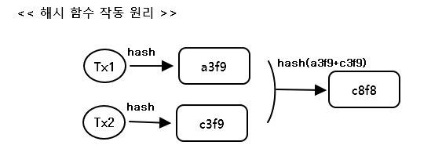
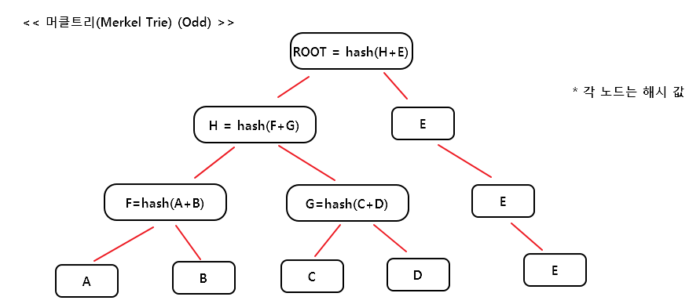
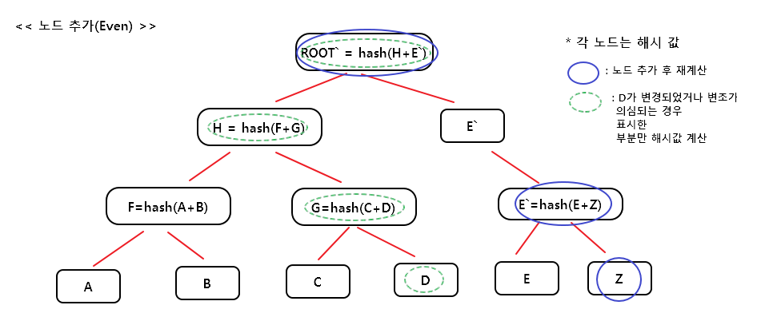
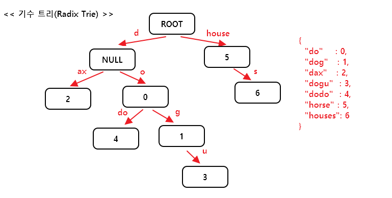
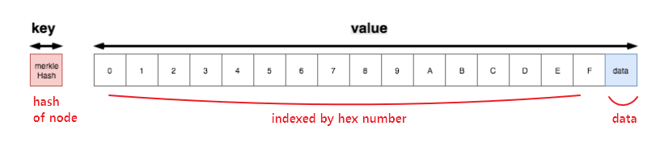
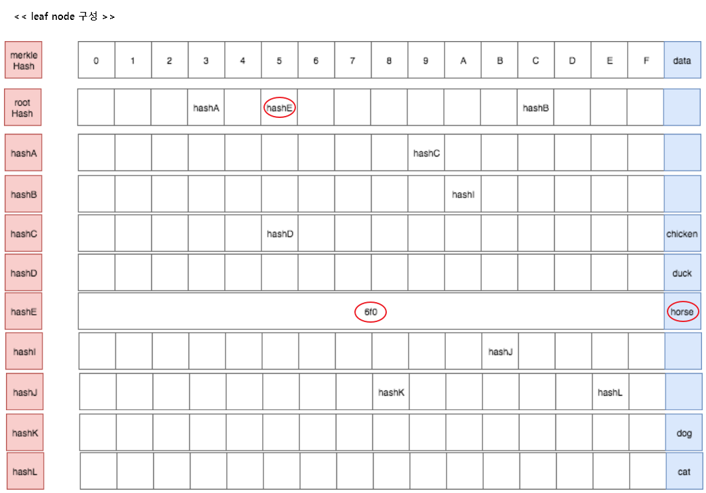
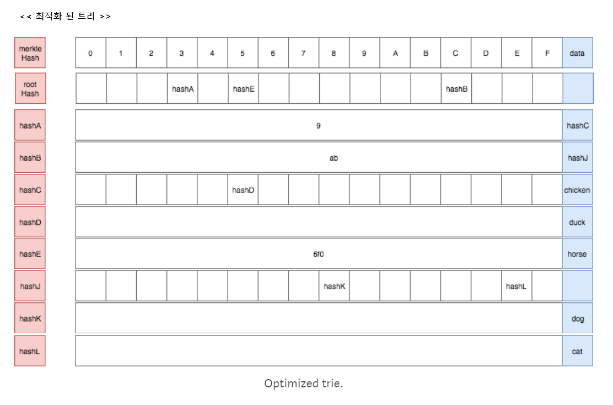

# Trie

- <a href="#hash-function">암호 해쉬 함수</a>
- <a href="#merkel-trie">머클트리(Merkel Trie)</a>
- <a href="#radix-trie">기수 트리(Radix Trie)</a>
- <a href="#patricia-trie">페트리시아 트리(Patricia Trie)</a>
- <a href="#ethereum-patricia-trie">이더리움 페트리시아 트리(Patricia Trie)</a>
- <a href="#database">Check Database(Parity + EthereumJ)</a>

<div id="hash-function"></div>  

## 암호 해쉬 함수  

=> input의 크기가 다르지만, output의 크기는 64바이트로 고정 된 암호화 된 문자열 값 생성  
=> keccak은 legacy SHA-3임. 표준 SHA-3과 다름  
=> 이더리움은 표준 SHA-3과 다른 keccak 암호 해시 함수를 사용  


> sample code  

```
@Test
public void sha256() {    
    String[] inputs = {
        "Core",
        "Core Ethereum",
        "Core Ethereum Programming"
    };

    for(String input : inputs) {
        byte[] output = HashUtil.sha256(input.getBytes());
        String outputStr  = Hex.toHexString(output);
        SimpleLogger.println("Input : {}\nOutput : {}  [{}]", input, outputStr, output.length);
    }
}
```  

> result  
=> 암호화 된 64바이트(자바 바이트 변수 == 2byte)의 고정된 문자열 생성

```
Input : Core
Output : 70ea1983c983deacc1b61805aea3d43648afd932f346fb2e5d9b15facd4035c2  [32]
Input : Core Ethereum
Output : c455abc9d19e2927ee650fa1b39e9278e63c3bb8cea63ba82e4eae5203d8a61f  [32]
Input : Core Ethereum Programming
Output : 811588e59dcdb157bc630a64e90acf644d02be3c4d067822bc55d9741de3f678  [32]
```


<div id="merkel-trie"></div>  

## 머클트리(Merkel Tree)  

#### 머클 트리의 기본 해시 함수

  

#### 머클 트리 구조 및 노드 추가


  

=> 위와 같이 각각 해쉬 값을 합쳐서 새로운 루트 해쉬 값을 계산  


---  


<div id="radix-trie"></div>  

## 기수 트리(Radix Trie)  

> Dataset  

```
{
  "do"    : 0,
  "dog"   : 1,
  "dax"   : 2,
  "dogu"  : 3,
  "dodo"  : 4,
  "horse" : 5,
  "houses": 6  
}
```  

#### 기본 기수 트리(Basic Radix Trie)  


=> 공간 낭비가 발생  
=> 분기가 없는 키(경로, 파란색 원)을 하나로 합쳐서 사용  

  

---  


<div id="patricia-trie"></div>  

## 페트리시아 트리(Patricia Trie)  

#### 노드 구성  

  

> Key vs Path  

- Key : database lookup  
- Path : Trie lookup  

- tdl : this is database lookup  
(키-값 데이터 베이스에서 조회한다고 생각)
- ttl : this is trie lookup  
(코드에서 조회 한다고 생각)  

#### dataset build up(향상 전 패트리시아 트리)  

> Dataset  

```
{
  "cab8"  : "dog",
  "cabe"  : "cat",
  "39"    : "chicken",  
  "395"   : "duck",
  "56f0"  : "horse"
}
```  

  

> "395" path에 해당하는 값 찾기  

- 1. 395를 연속되게 탐색 (3가지 부분 : 3, 9, 5)  
- 2. rootHash를 시작으로 rootNode 검색(tdl)  
- 3. rootNode 중 3번째 인덱스 element => hashA (ttl)  
- 4. hashA의 node 조회(tdl) => 9번째 인덱스 element  
  => hashC(ttl)  
- 5. hashC의 node 조회(tdl) => 5번째 인덱스 element  
  => hashD(ttl)  
- 6. path 3개를 모두 탐색했으므로 value를 얻을 것  
  => hashD(ttl)에 상응하는 노드의 data element 인 "duck"  


=> "56f0"인 "horse"를 찾기 위해 모든 empty node를 탐색  
=> improved patricia trie  

=> 위의 문제를 2가지 부분 문제로 나눌 수 있음  
- sub prob1) No divergent path points to a data at the end (e.g 56f0)  
=> 끝의 데이터를 가리키는 분기 경로가 없음 (=> leaf node)  
- sub prob2) No divergent path is branched in the middle (cab of {cabe, cab8})  
=> 분기 경로 중 중간에 브런치가 없음? (=> extension node)  

#### leaf, extension node  

**leaf, extension 노드 정의**    
=> 2개의 element( {partialPath,value} )로 이루어진 노드  
- 1) partialPath : empty value node를 줄이는데 도와줌  
- 2) value = { data if leaf  
             merkel hash if extension }  


##### leaf 노드로 변경(hashE)  

  

=> hashE == left node to get value of "56f0" path  

> "56f0" 탐색  


- 1. rootHash의 5의 element & value == hashE  
- 2. hashE는 leaf or extension 노드 이므로  
남은 경로(reminder(rest of path) == "56f0" - "5" == "6f0") 과  
partialPath(노드의 첫번째 element 값) 비교  
=> reminder == partialPath  => leaf node  
=> return data field "horse"  

=> 상위의 기수 트리 향상하는 것과 비슷한 원리  


##### extension 노드로 변경(+기존 leaf 노드)  

  

=> hashB는 extension node (확장 노드)  

> "cab8" 탐색  

- 1. rootHash의 인덱스 c의 value == hashB (reminder == "ab8")  
- 2. reminder("ab8")과 hashB의 partialPath("ab")비교  
  => extension 노드  
  => hashB의 data(merkel tree) == hashJ  
- 3. hashJ의 인덱스 8의 값 == hashK  
- 4. reminder(empty)과 hashK의 partialPath(empty) 비교  
  => 같으므로 값 "dog" 리턴  

##### final optimized (hashK, hashL)   

   

#### Java Code Simple Sample  

> Java Code  

```
@Test
public void testFromHarmony() {
    TrieImpl trie = new TrieImpl();
    List<Pair<String, BigInteger>> initAccounts = Arrays.asList(
        new Pair<>("102e61f5d8f9bc71d0ad4a084df4e65e05ce0e1c", new BigInteger("10000000000000000000000")),
        new Pair<>("cb26785242C9E19AFc2BDDE89525D5fbdaf068c2", new BigInteger("10000000000000000000000")),
        new Pair<>("33d45ea0f0f58d1975bde470785c4b159b3b79bc", new BigInteger("10000000000000000000000")),
        new Pair<>("0000000000000000000000000000000000000001", BigInteger.ONE),
        new Pair<>("0000000000000000000000000000000000000002", BigInteger.ONE),
        new Pair<>("0000000000000000000000000000000000000003", BigInteger.ONE),
        new Pair<>("0000000000000000000000000000000000000004", BigInteger.ONE)
    );

    for(Pair<String, BigInteger> accountPair : initAccounts) {
        trie.put(Hex.decode(accountPair.getKey()), new AccountState(BigInteger.ZERO, accountPair.getValue()).getEncoded());
    }
    System.out.println("State root hash : " + Hex.toHexString(trie.getRootHash()));
    System.out.println("## Trie dump");
    System.out.println(trie.dumpTrie(true));
}
```

> Result  

```
State root hash : 40fcce193cabceaba8562cc8cb0a21202b5f6d1d48445472b157ad778983b61c
## Trie dump
Root: 0x40fcce19
0x40fcce19 ==> [0x175cfb4b,0xfc71d8de,,0xf7878da6,,,,,,,,,0x41c30d96,,,]
0x175cfb4b ==> [<00000000000000000000000000000000000000>, 0x2885ca34]
0x2885ca34 ==> [,0x7cb2e187,0x7cb2e187,0x7cb2e187,0x7cb2e187,,,,,,,,,,,]
0x7cb2e187 ==> [<T>, "f8448001a0... len 70"]
0x7cb2e187 ==> [<T>, "f8448001a0... len 70"]
0x7cb2e187 ==> [<T>, "f8448001a0... len 70"]
0x7cb2e187 ==> [<T>, "f8448001a0... len 70"]
0xfc71d8de ==> [<02e61f5d8f9bc71d0ad4a084df4e65e05ce0e1cT>, "f84e808a02... len 80"]
0xf7878da6 ==> [<3d45ea0f0f58d1975bde470785c4b159b3b79bcT>, "f84e808a02... len 80"]
0x41c30d96 ==> [<b26785242c9e19afc2bdde89525d5fbdaf068c2T>, "f84e808a02... len 80"]
```

> Search 102e61f5d8f9bc71d0ad4a084df4e65e05ce0e1c  

1. rootHash의 path =="1" => 0xfc71d8de  
(Reminder : 02e61f5d8f9bc71d0ad4a084df4e65e05ce0e1c)   
2. hash 0xfc71d8de 값 == 0xfc71d8de ==> [<02e61f5d8f9bc71d0ad4a084df4e65e05ce0e1cT>...  
=> Reminder = partialPath  
=> Value가 AccountState Encoded 된 값

#### Merkel Trie Hash  

> org.ethereum.trie.TrieImpl  

```
    @Override
    public byte[] getRootHash() {
        encode();
        return root != null ? root.hash : EMPTY_TRIE_HASH;
    }

    ...

    private void encode() {
        if (root != null) {
            root.encode();
        }
    }

    public byte[] encode() {
      return encode(1, true);
    }

    private byte[] encode(final int depth, boolean forceHash) {
      ... 트리 종류 검사

      byte[] value = kvNodeGetValue();
      ret = encodeList(encodeElement(kvNodeGetKey().toPacked()),
                      encodeElement(value == null ? EMPTY_BYTE_ARRAY : value));
      ...
    }
```  

=> key랑 value랑 같이 encoding 되는 듯?
=> 노드가 여러개 이면 더 복잡해짐 추후 더 분석 필요

---   

<div id="ethereum-patricia-trie"></div>  

## 이더리움 페트리시아 트리(Patricia Trie)  

=> 상태 머클 패트리시아 트리는 새로운 어카운트가 추가되거나 삭제되는 등 변경이  
자주 발생  
=> 머클 트리는 변경 된 부분과 관련된 트리의 해쉬 값을 매번 재계산(상위 머클 트리 설명)  
=> 재계산을 줄이기 위한 2가지 추가적인 개선사항을 도출  

- 트리의 깊이를 한정 짓는 것  
(트리의 깊이를 한정 짓지 않으면 디도스 공격 등으로 트리를 무한정 깊게 만들어  
급격한 성능 저하를 가져올 수 있음)  
- 업데이트가 되더라도 머클 루트가 변경되지 않도록 머클 루트에 숫자 값을 주고  
이 값에 한정되도록 하는 것  
(전체 트리를 재계산하더라도 트리 루트는 변경되지 않음)  

#### 이더리움의 머클 패트리시아 트리의 주요 특성  

- 머클 패트리시아 트리 내의 모든 항목은 RLP(Recursive Length Prefix) 인코딩  
  
(https://medium.com/coinmonks/data-structure-in-ethereum-episode-3-patricia-trie-b7b0ccddd32f)

- 모든 노드에 대한 경로는 RLP 인코딩 후 Keccak256 암호 해시 후 레벨DB에 저장  
=> 머클 패트리시아 루트 노드는 전체 트리에 대해 해시 암호화 된 상태  
=> 레벨DB에 저장되는 키는 실제 다음 노드에 대한 경로(path)  
(트리 내에 다음 노드의 경로를 알 수 있는 키로 조회하면, 해당 키에 대한 값을 이용하여  
다음 노드에 대한 접근 경로를 알 수 있어서 마지막 노드에 저장된 경로 값을 찾을 수 있음)  
- 트리(trie)는 성능 향상을 위해 공백노드(Blank Node), 리프 노드(Leaf Node),  
확장 노드(Extension Node), 브랜치 노드(Branch Node)라는 4가지 타입을 가짐  

<table>
  <tr>
    <td>공백(Blank) 노드</td>
    <td>비어 있는 노드(NULL)</td>
  </tr>
  <tr>
    <td>리프(Leaf) 노드</td>
    <td>
      일련의 [RLP 인코딩된 경로, 값]<br/>
      값은 이더 같은 실제 값을 의미
    </td>
  </tr>
  <tr>
    <td>확장(Extension) 노드</td>
    <td>일련의 [RLP 인코딩된 경로, 키]의 목록<br/>
    키는 연결된 노드의 해쉬 값이고 레벨DB 호출 시 키 값으로 사용된다.</td>
  </tr>
  <tr>
    <td>브런치(Branch) 노드</td>
    <td>
      [0,...,f,값]으로 17개 항목으로 구성된 리스트 구조.<br/>
      리스트 중 16항목은
      문자값(0~f)으로 다음의 노드를 가리키는 키(총 16개의 자식 노드를 가질 수있음)
      마지막 항목이 [키, 값]을 갖는다면 17번째 값 항목에는 해당 [키,값] 중 [값]만 저장
    </td>
  </tr>
</table>  

- 리프 vs 확장 노드를 구별하기 위해 선행 구분자를 사용  
=> 선행구분자는 헥사 선행구분자(Hex-Prefix) 방식의 인코딩을 한 특별한 문자  
<table>
  <tr>
    <td>선행구분자(Prefix)</td>
    <td>노드 타입</td>
    <td>경로값의 길이</td>
  </tr>
  <tr>
    <td>0</td>
    <td>확장 노드</td>
    <td>짝수</td>
  </tr>
  <tr>
    <td>1</td>
    <td>확장 노드</td>
    <td>홀수</td>
  </tr>
  <tr>
    <td>2</td>
    <td>리프 노드</td>
    <td>짝수</td>
  </tr>
  <tr>
    <td>3</td>
    <td>리프 노드</td>
    <td>홀수</td>
  </tr>
</table>  

  
(https://i.stack.imgur.com/YZGxe.png)


---  


<div id="database"></div>
## Check Database(Parity + EthereumJ)  


---  

## Ref  

- https://github.com/c-geek/merkle
- https://medium.com/coinmonks/data-structure-in-ethereum-episode-2-radix-trie-and-merkle-trie-d941d0bfd69a  
- https://medium.com/coinmonks/data-structure-in-ethereum-episode-3-patricia-trie-b7b0ccddd32f  
- https://github.com/ethereum/wiki/wiki/Patricia-Tree  
- https://ethereum.github.io/yellowpaper/paper.pdf  
(Appendix D. Modified Merkle Patricia Tree, 19p)  
