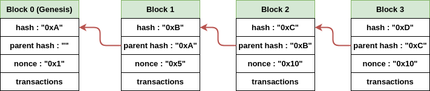
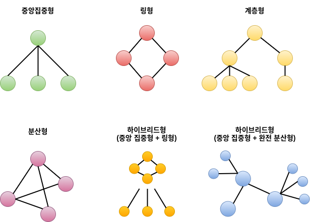
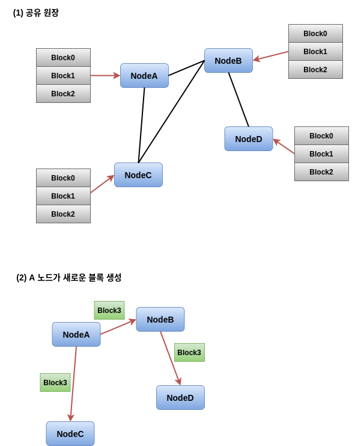

# 블록체인 개요  

간단하게 블록체인은 블록 데이터의 링크드 리스트 라고도 할 수 있다  

블록 Hash 값의 Input을 (parent hash, nonce) 라고 가정해보자.  
즉 `blockHash = hash(parentHash, nonce)`  

만약 Block1에 대하여 nonce 값을 "0x2"로 데이터 변경을 한다면  

1. Block1에 대한 Hash 값은 `0xB == hash("0xA", "0x5")` 에서 `0xB' == hash("0xA", "0x2")`로 변경

2. Block2도 마찬가지로 parent hash(Block1) 값이 변경 되었으므로 기존 `0xC == hash("0xB", "0x10")`에서 `0xC' == hash("0xB'", "0x10")` 으로 다른 해시 값을 갖는다.  

위와 같이 특정 블록의 필드 값 하나만 변경하여도 이어지는 모든 블록에 대한 해시 값이 변경된다  

# 블록체인의 P2P  

P2P(Peer-to-Peer) 컴퓨팅은 네트워크에 참여한 모든 컴퓨터 동일한 역할과 기능을 수행하는  
컴퓨팅 처리 방식(여기서 컴퓨팅은 노드 OR 피어 등으로 부르는 것과 같은 의미)  

P2P 네트워크 연결 방식은 아래와 같이 존재한다.  

  

이더리움의 경우 완전 분산형 P2P 토폴로지로 구성  
(모든 참여한 노드가 동등한 권한과 권리를 가지고 있음)   

완전 분산형 P2P의 경우 아래와 같은 장단점이 존재한다.  

**장점**  

- 누구나 참여할 수 있기 때문에 확장성이 좋음
- 노드들이 서로 연결되어 있기 때문에 일부 노드에 문제가 생겨도 안전  
- 관리 및 감독 기능이 별도로 없기 때문에 책임 질 것이 없음  

**단점**  

- 동등한 권한의 노드들로 구성하기 때문에 관리가 어려움  
- 연결된 노드가 안전한지 검증하기 어렵기 때문에 신뢰성이 떨어짐  
- 노드마다 컴퓨팅 파워, 네트워크 속도 등이 다르기 때문에 전체 성능에 영향을 미침  

블록체인의 각각의 노드는 **스스로 블록을 검증** 하고 각각의 상태를 유지한다.  

예를들어 아래와 같은 nodeA, nodeB, nodeC, nodeD 노드가 있다고 가정해보자.  

  

(1)과 같이 각각의 노드는 같은 원장(Ledger)을 가지고 있다.  

(2)과 같이 nodeA 노드가 블록을 생성 한다면, nodeB, nodeC에게 전파하고  
nodeB는 nodeD에게 전파하여 모든 노드가 같은 블록을 가지게 된다.  
여기서 각각의 노드는 새로운 블록을 전파 받을때 주어진 Consensus를 기반으로  
유효성을 검증하고 유효하지 않은 블록을 전파 할 경우 연결을 끊게 된다.  
