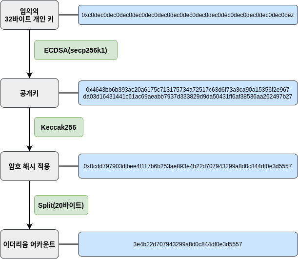

# Account  

- [1. 어카운트 종류](#1-어카운트-종류)
- [2 어카운트 상태 전이](#2-어카운트-상태-전이)
- [3 어카운트 구조](#3-어카운트-구조)  
- [4 어카운트 생성](#4-어카운트-생성)  

---  

# 1 어카운트 종류

이더리움 어카운트(Account)는 모든 트랜잭션의 실행 주체이자 기본 단위  
이더리움의 어카운트는 아래와 같은 2가지 타입이 존재  

**외부 소유 어카운트(EOA, Externally Owned Account)**  

- 일반적으로 말하는 이더리움 사용자 어카운트  
- 직접 개인키(Private key)로 관리하며 스마트 컨트랙트 실행 코드를 가지고 있지 않음  
- 보통 EOA 간의 메시지는 이더를 전송하는 트랜잭션

**컨트랙트 어카운트(CA, Contract Account)**  

- 일반적으로 부르는 스마트컨트랙트의 정식 용어  
- EOA나 다른 CA의 메시지를 받은 후 내부의 스마트 컨트랙트 코드를 실행  
- 자기 자신이 직접 새로운 트랜잭션을 실행할 수 없음  

---  

# 2 어카운트 상태 전이

Account는 잔액(balance) 이나 트랜잭션, 스마트 컨트랙트의 컴파일 된 중간 코드처럼  
필요한 데이터를 저장하기 위한 일련의 공간을 갖고 이러한 모든 것을 어카운트의 상태(state)라 한다  

이더리움은 transaction 기반의 상태 머신으로 볼 수 있다  

`APPLY(S,TX) -> S', where S : 현재 상태, APPLY() : 상태 변이 함수, S' 변이된 상태`  

예를들어 아래와 같이 2개의 Account가 있다고 가정해보자.  

  

트랜잭션(상태 변이 함수)이 발생하기 전 accountA는 잔액이 100, accountB는 잔액이 50으로  
각각의 상태를 가지고 있다.  

상태 변이 함수 인 트랜잭션에 의해 accountA의 잔액은 `100` -> `50`으로, accountB의 잔액은  
`50` -> `30` 으로 상태가 변경 되었다. (트랜잭션 수수료 등 제외)  

---  

# 3 어카운트 구조  

> 어카운트 주소  

```go
// accounts/accounts.go
type Account struct {
	Address common.Address `json:"address"` // 이더리움 주소 (20 바이트)
	URL     URL            `json:"url"`     // Optional resource locator within a backend
}

// common/types.go  
const (		
	AddressLength = 20
)

type Address [AddressLength]byte  
```  

> 어카운트 정보  

```go
// core/state/state_object.go  

type Account struct {
	Nonce    uint64
	Balance  *big.Int
	Root     common.Hash // 머클 패트리시아 트리의 루트 해시
	CodeHash []byte
}
```  

| nonce     | 해당 어카운트의 보내진 트랜잭션의 수 (0으로 시작) 만약 컨트랙트 어카운트이면 어카운트에 의해 생성 된 컨트랙트 수 |
|-----------|--------------------------------------------------------------------------------------------|
| balance   | 어카운트의 잔액(wei)                                                                          |
| root      | 해당 어카운트가 저장될 머클 패트리시아 트리의 루트 노드 (암호 해시 적용 된)                               |
| code hash | 스마트 컨트랙트 바이트 코드의 해시 (nil 이면 EOA, 아니면 CA)                                         |

---  

# 4 어카운트 생성  

이더리움 어카운트는 비대칭 암호화 알고리즘인 256비트 ECDSA(타원형 곡선 방식)를 사용  

  
