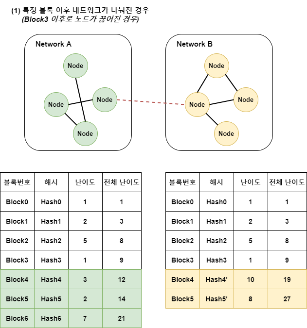
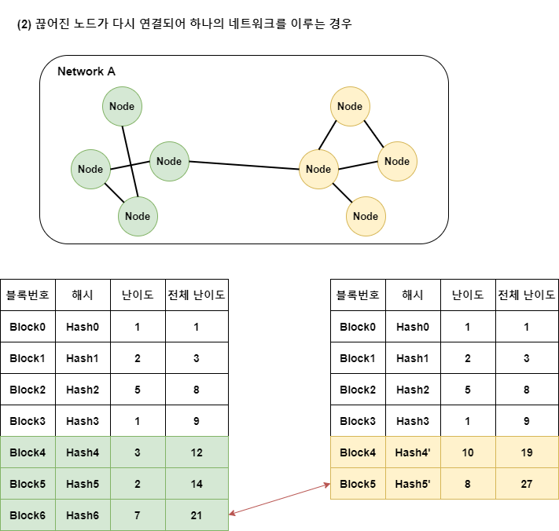
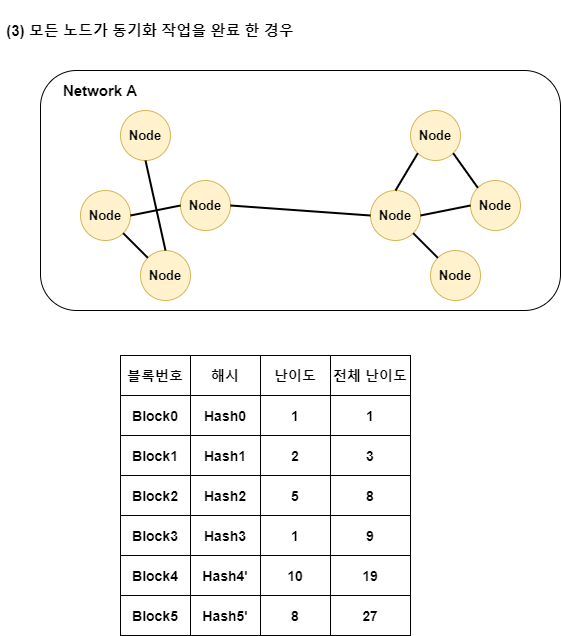

# Block  

- [1. Block 개요](#1-Block-개요)  
- [2. Block 구조](#2-Block-구조)  
- [3. Block 동기화](#2-Block-동기화)  

---  

# 1. Block 개요  

이더리움에서 어카운트의 상태 전이를 발생시키는 트랜잭션들과 모든 관련 정보는 블록이라는 구조체에 저장된다.  
[개요](./1.blockchain.md)에서 살펴본 것과 같이 모든 블록은 체인처럼 서로 연결 되어 있다.  
이를 **블록체인(Block chain)** 이라고 부른다.  
P2P 네트워크와 동기화 프로토콜을 통해 네트워크에 연결 된 모든 노드에게 전파되어 공유 된다.  
즉, 블록체인이 공유 원장이다.  

블록은 **블록 헤더**, **엉클 블록**, **트랜잭션** 으로 구성되어 있다.  

---  

# 2. Block 구조  

> Block 필드  
https://github.com/INFURA/go-ethlibs/blob/master/eth/block.go   

```go
// eth/block.go  
type Block struct {
	Number           *Quantity  `json:"number"`
	Hash             *Hash      `json:"hash"`
	ParentHash       Hash       `json:"parentHash"`
	SHA3Uncles       Data32     `json:"sha3Uncles"`
	LogsBloom        Data256    `json:"logsBloom"`
	TransactionsRoot Data32     `json:"transactionsRoot"`
	StateRoot        Data32     `json:"stateRoot"`
	ReceiptsRoot     Data32     `json:"receiptsRoot"`
	Miner            Address    `json:"miner"`
	Author           Address    `json:"author,omitempty"` // Parity-specific alias of miner
	Difficulty       Quantity   `json:"difficulty"`
	TotalDifficulty  Quantity   `json:"totalDifficulty"`
	ExtraData        Data       `json:"extraData"`
	Size             Quantity   `json:"size"`
	GasLimit         Quantity   `json:"gasLimit"`
	GasUsed          Quantity   `json:"gasUsed"`
	Timestamp        Quantity   `json:"timestamp"`
	Transactions     []TxOrHash `json:"transactions"`
	Uncles           []Hash     `json:"uncles"`

	// Ethhash POW Fields
	Nonce   *Data8 `json:"nonce"`
	MixHash *Data  `json:"mixHash"`

	// POA Fields (Aura)
	Step      *string `json:"step,omitempty"`
	Signature *string `json:"signature,omitempty"`

	// Parity Specific Fields
	SealFields *[]Data `json:"sealFields,omitempty"`

	// Track the flavor so we can re-encode correctly
	flavor string
}

// eth/data.go  
type Data string
type Data8 Data
type Data20 Data
type Data32 Data
type Data256 Data

// Aliases
type Hash = Data32
type Topic = Data32
```  


> Response : eth_getBlockByHash from Parity AURA  

```json
{
  "jsonrpc": "2.0",
  "result": {
    "number": "0x1834b",
    "hash": "0x6b00bd916ee957b39a51f238d862eb18afcc38b7827bcff29dd98d76f33ed4ce",
    "parentHash": "0xcf1a4ff229500b64e298d858355905281487b05e461153a876c10849c2b6d669",
    "sha3Uncles": "0x1dcc4de8dec75d7aab85b567b6ccd41ad312451b948a7413f0a142fd40d49347",
    "logsBloom": "0x00000000000000000000000000000000000000000000000000000000000000000000000000000000000000000000000000000000000000000000000000000000000000000000000000000000000000000000000000000000000000000000000000000000000000000000000000000000000000000000000000000000000000000000000000000000000000000000000000000000000000000000000000000000000000000000000000000000000000000000000000000000000000000000000000000000000000000000000000000000000000000000000000000000000000000000000000000000000000000000000000000000000000000000000000000000",
    "transactionsRoot": "0x3467a08f304aa353b525693205e76c230a63ad733f84a0b936d45269f0133d02",
    "stateRoot": "0x9318823f03272662048169a8f625af7612e1a311cf27c31c44d22a655fcf3f4b",
    "receiptsRoot": "0x056b23fbba480696b65fe5a59b8f2148a1299103c4f57df839233af2cf4ca2d2",
    "miner": "0x00f03dfe082deb9a3e67dfbf49eea7ced8c4120d",
    "author": "0x00f03dfe082deb9a3e67dfbf49eea7ced8c4120d",
    "difficulty": "0xfffffffffffffffffffffffffffffffc",
    "totalDifficulty": "0x1834affffffffffffffffffffffffede168bb",
    "extraData": "0xd5830108038650617269747986312e32302e30826c69",
    "size": "0x2b2",    
    "gasLimit": "0x47b760",
    "gasUsed": "0x5208",
    "timestamp": "0x5a9b63e1",
    "transactions": [
      {
        "blockHash": "0x6b00bd916ee957b39a51f238d862eb18afcc38b7827bcff29dd98d76f33ed4ce",
        "blockNumber": "0x1834b",
        "chainId": "0xd46e5",
        "condition": null,
        "creates": null,
        "from": "0x00140916ae81b8c75ebee92d619a085b5feb2d71",
        "gas": "0x5208",
        "gasPrice": "0x0",
        "hash": "0x6577c7eb690acdf908632879b4ca5c46110dd13c85b09d96c635d334c94246f8",
        "input": "0x",
        "nonce": "0x0",
        "publicKey": "0x40139b0dd0f2755ffbacf1c50d66136fa566fbbd67280156f032d4647a6f2e029af3873361724aebdf5d4dd6faf54eae05d83e478e854cfc40790503587274db",
        "r": "0x88a8598811ae2b4561b7f3bcb672f8e6ba65ad898cd93f95720f5e43d013e032",
        "raw": "0xf86a80808252089400e8fa1afbadfdaeefa0672a4573f707116e5ab4881bc16d674ec8000080831a8deea088a8598811ae2b4561b7f3bcb672f8e6ba65ad898cd93f95720f5e43d013e032a0345ddded8b86c291ada9b9cc7ae32022f88ef9aee3312ece59e19893f7c53dd1",
        "s": "0x345ddded8b86c291ada9b9cc7ae32022f88ef9aee3312ece59e19893f7c53dd1",
        "standardV": "0x1",
        "to": "0x00e8fa1afbadfdaeefa0672a4573f707116e5ab4",
        "transactionIndex": "0x0",
        "v": "0x1a8dee",
        "value": "0x1bc16d674ec80000"
      }
    ],    
    "uncles": [],

    "signature": "128598d715382131a4d5b378eebaf874a57c99f367c6c8b9eeca1d33e2400dfb1312cfdb33a441eff8427ff4bf21536d02e8e2cdb4431a8ded5d8a3542d244b000",
    "step": "304026618",
    "sealFields": [
      "0x84121f13fa",
      "0xb841128598d715382131a4d5b378eebaf874a57c99f367c6c8b9eeca1d33e2400dfb1312cfdb33a441eff8427ff4bf21536d02e8e2cdb4431a8ded5d8a3542d244b000"
    ]
  },
  "id": 1
}
```  


> Block fields 설명  

*(Ethash는 이더리움 POW, Clique는 go-ethereum POA, Aura는 Pairty POA)*    

TODO : 블록 필드 설명 추가 + 블록 해시 input 설명  

|      **Key**     |                                                             **Ethash**                                                            | **Clique** | **Aura** |
|:----------------:|:---------------------------------------------------------------------------------------------------------------------------------:|------------|----------|
| number           | 현재 블록 번호   (Genesis 0 부터 1씩 증가)                                                                                        | 동일       | 동일     |
| hash             | 블록 헤더의 해시 값                                                                                                               | 동일       | 동일     |
| parentHash       | 부모 블록 헤더의 해시 값                                                                                                          | 동일       | 동일     |
| sha3Uncles       | 엉클 블록들의 해시 값                                                                                                             |            |          |
| logsBloom        | 로그 정보들을 검색하는 데 사용하는   32바이트 블룸 필터   (블룸 필터는 해당 블록 내에 있는   전체 트랜잭션 로그에 대한 블룸 필터) |            |          |
| transactionsRoot | 현재 블록 내에 모든 트랜잭션의   머클 트리의 루트 노드에 대한 해시 값                                                             |            |          |
| stateRoot        | 어카운트 상태 정보가 모여 있는   머클 패트리시아 트리의 루트 노드에   대한 해시 값                                                |            |          |
| receiptsRoot     | 현재 블록 내에 모든 트랜잭션   리시트들의 머클 트리의 루트 노드에 대한 해시 값                                                    |            |          |
| mixHash          | 64비트 해시인 Nonce와 256비트 해시인   MixDigest는 함께 사용되어 블록 생성을   위한 마이닝 작업 시 충분한 계산을 수행하는 데 이용 |            |     -    |
| miner            | 현재 블록의 마이너 어카운트 주소                                                                                                  |            |          |
| author           | 현재 블록의 마이너 어카운트 주소                                                                                                  |            |          |
| difficulty       | 현재 블록의 난이도                                                                                                                |            |          |
| totalDifficulty  | genesis부터 현재 블록까지의 전체 난이도 합                                                                                        |            |          |
| extraData        | 현재 블록과 관련된 기타 추가 정보                                                                                                 |            |          |
| size             | 블록 사이즈                                                                                                                       |            |          |
| gasLimit         | 블록당 현재 지급 가능한 최대 가스 총합                                                                                            |            |          |
| gasUsed          | 현재 블록 내에 트랜잭션에 의해 사용 된   가스의 총합                                                                              |            |          |
| timestamp        | 블록 생성 시간(epoch)                                                                                                             |            |          |
| transactions     | 블록에 포함 된 트랜잭션 리스트                                                                                                    |            |          |
| uncles           | 엉클 블록 해시 리스트                                                                                                             |            |          |
| signature        |                                                                 -                                                                 |            |          |
| step             |                                                                 -                                                                 |            |          |
| sealFields       |                                                                 -                                                                 |            |          |
|                  |                                                                                                                                   |            |          |

---  

# 3. Block 동기화  

블록체인 개요에서 이더리움 노드는 완전 분사형 P2P 토폴로지를 이용하며  
모든 노드가 동등한 역할을 가지며 스스로 블록을 검증 할 수 있다고 하였다  

이더리움은 만약 다른 해시 값을 가진 유효한 2개의 블록을 받으면 두 블록의  
전체 난이도를 비교하고, 만약 현재 블록보다 난이도가 높으면 자신의 블록 정보를  
새로운 블록으로 reorganization 한다.  

아래의 그림 **(1)** 같이 특정 블록(`Block3`)이후 연결이 끊어져(`빨간 점선`) 이더리움 전체  
네트워크가 2개로 나눠진 경우를 고려해보자.  

  

각각의 네트워크 A,B에서는 마이너가 블록을 생성하고 동기화 하고 있으며  
블록 번호 `4,5`는 같지만 `난이도`가 달라 `전체 난이도`가 달라지고 해시 값도  
달라지게 된다. (트랜잭션, 마이너 등 다른 Input도 다르다)  

아래 그림 **(2)** 과 같이 노드가 다시 연결 된 상황을 고려해보자  

**Note**  
- 노드가 연결 되면 `Best block`을 서로 주고 받으며 비교한다.  
	- NetworkA의 Best block은 `(Block6, Hash6, 21)`
	- NetworkB의 Best block은 `(Block5, Hash5', 27)`
- NetworkA는 Block6의 해시 `Hash6`, 전체 난이도`21`인 블록체인을 가지고 있다.  
- NetworkB는 Block5의 해시 `Hash5'`, 전체 난이도 `27`인 블록체인을 가지고 있다.  

  


**NetworkA에 포함 된 노드**  
NetworkA에 포함 된 노드들은 자신의 기존 블록 체인(Block6, Hash6)과 새로운 체인(Block5, Hash5')  
을 비교하여 더 적절한 체인을 선택해야 한다. 전체 난이도(`totalDifficulty`)를 비교해보면  
자신의 체인은 `21`이고 새로운 체인은 `27` 이므로 새로운 체인(Block5, Hash5')로 `Reorganization`  
이 일어난다.  

**NetworkB에 포함 된 노드**  
NetworkA와 마찬가지로 자신의 기존 블록체인(Block5, Hash5')과 새로운 체인(Block6, Hash6)  
을 비교하여 자신의 체인의 전체 난이도는 `27` 이고 새로운 체인은 `21` 이므로 기존 체인을  
유지한다.  

모든 노드가 동기화 된 이후 아래와 같이 **(3)** 하나의 네트워크로 모든 동일한 블록 체인을  
가지게 된다  

  

**Note**  

- 기존 체인의 블록들(Hash4, Hash5, Hash6)과 블록에 포함 된 트랜잭션은 추후 Finality 부분에서  
설명


---  
