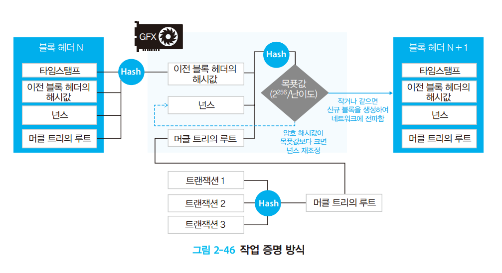

# Consensus  

- [1. Consensus 개요](#1-Consensus-개요)  
- [2. POW](#2-POW)  
- [3. POA Clique](#3-POA-Clique)  
- [4. POA Aura](#4-POA-Aura)  

---  

# 1. Consensus 개요  

이더리움처럼 완전한 탈 중앙집중화된 P2P 네트워크에서는 다양한 원인으로 인해  
정보 전달 과정에 문제가 발생할 수 있다. 따라서 전달된 정보가 문제가 없다는 것을  
참여자(Node)가 스스로 검증하고 그 유효성을 판단해야한다.  

아래의 consensus 패키지의 consensus.go의 Engine 인터페이스를 구현하여  
합의 엔진이 이루어 진다.  

> consensus.go  
https://github.com/ethereum/go-ethereum/blob/master/consensus/consensus.go  

```go
// Engine is an algorithm agnostic consensus engine.
type Engine interface {
	// Author retrieves the Ethereum address of the account that minted the given
	// block, which may be different from the header's coinbase if a consensus
	// engine is based on signatures.
	Author(header *types.Header) (common.Address, error)

	// VerifyHeader checks whether a header conforms to the consensus rules of a
	// given engine. Verifying the seal may be done optionally here, or explicitly
	// via the VerifySeal method.
	VerifyHeader(chain ChainReader, header *types.Header, seal bool) error

	// VerifyHeaders is similar to VerifyHeader, but verifies a batch of headers
	// concurrently. The method returns a quit channel to abort the operations and
	// a results channel to retrieve the async verifications (the order is that of
	// the input slice).
	VerifyHeaders(chain ChainReader, headers []*types.Header, seals []bool) (chan<- struct{}, <-chan error)

	// VerifyUncles verifies that the given block's uncles conform to the consensus
	// rules of a given engine.
	VerifyUncles(chain ChainReader, block *types.Block) error

	// VerifySeal checks whether the crypto seal on a header is valid according to
	// the consensus rules of the given engine.
	VerifySeal(chain ChainReader, header *types.Header) error

	// Prepare initializes the consensus fields of a block header according to the
	// rules of a particular engine. The changes are executed inline.
	Prepare(chain ChainReader, header *types.Header) error

	// Finalize runs any post-transaction state modifications (e.g. block rewards)
	// but does not assemble the block.
	//
	// Note: The block header and state database might be updated to reflect any
	// consensus rules that happen at finalization (e.g. block rewards).
	Finalize(chain ChainReader, header *types.Header, state *state.StateDB, txs []*types.Transaction,
		uncles []*types.Header)

	// FinalizeAndAssemble runs any post-transaction state modifications (e.g. block
	// rewards) and assembles the final block.
	//
	// Note: The block header and state database might be updated to reflect any
	// consensus rules that happen at finalization (e.g. block rewards).
	FinalizeAndAssemble(chain ChainReader, header *types.Header, state *state.StateDB, txs []*types.Transaction,
		uncles []*types.Header, receipts []*types.Receipt) (*types.Block, error)

	// Seal generates a new sealing request for the given input block and pushes
	// the result into the given channel.
	//
	// Note, the method returns immediately and will send the result async. More
	// than one result may also be returned depending on the consensus algorithm.
	Seal(chain ChainReader, block *types.Block, results chan<- *types.Block, stop <-chan struct{}) error

	// SealHash returns the hash of a block prior to it being sealed.
	SealHash(header *types.Header) common.Hash

	// CalcDifficulty is the difficulty adjustment algorithm. It returns the difficulty
	// that a new block should have.
	CalcDifficulty(chain ChainReader, time uint64, parent *types.Header) *big.Int

	// APIs returns the RPC APIs this consensus engine provides.
	APIs(chain ChainReader) []rpc.API

	// Close terminates any background threads maintained by the consensus engine.
	Close() error
}
```  

각각의 합의 엔진에 따라 블록의 난이도 계산, 헤더 검증 등의 작업이 이루어 진다.  

---  

# 2. POW  
**작업 증명(PoW, Proof of Work) 방식** 은 누구나 블록 생성에 참여 할 수 있으며  
복잡한 계산 문제의 해답을 가장 빨리 찾은 마이너의 블록을 블록체인에 등록하고 이에  
대한 수행 결과로 보상을 진행한다. 계산 문제를 빨리 풀기 위해서는 많은 양의 컴퓨팅  
연산 파워가 필요하므로 위변조를 위해서는 막대한 투자를 해야한다.  

> 작업 증명 방식  
(N+1 블록을 생성 하려는 과정)

  
출처 : [코어 이더리움](https://book.naver.com/bookdb/book_detail.nhn?bid=13496085)  

1. Pending transaction pool에 있는 트랜잭션들을 모아 신규 블록 구성  
2. **이전 블록 헤더의 해시 값**, **트랜잭션 머클 트리의 루트**, **임의의 논스** 를 기반으로  
암호 해시. 목푯값(Target Threshold) 보다 작거나 같은 값이 나올때까지 `Nonce` 값을 변경하며 계산
3. 목푯값 보다 작은 값을 찾으면 해당 `Nonce`를 저장한 후 연결되어 있는 주변의 노드에 브로드캐스팅 한다.  
4. 만약 동시에 다른 마이너가 블록을 생성하면 난이고 높고 높이가 높은 쪽이 선택되고 버림 받은 다른 블록은  
엉클 블록이 된다.  

아래와 같이 go-ethereum의 `ethash` 패키지의 `Prepare` 메소드와 연관 된 코드를 살펴보자  

> ethash/consensus.go

```go

// Ethash proof-of-work protocol constants.
var (
  ...
	// calcDifficultyConstantinople is the difficulty adjustment algorithm for Constantinople.
	// It returns the difficulty that a new block should have when created at time given the
	// parent block's time and difficulty. The calculation uses the Byzantium rules, but with
	// bomb offset 5M.
	// Specification EIP-1234: https://eips.ethereum.org/EIPS/eip-1234
	calcDifficultyConstantinople = makeDifficultyCalculator(big.NewInt(5000000))
  ...
)

// Prepare implements consensus.Engine, initializing the difficulty field of a
// header to conform to the ethash protocol. The changes are done inline.
func (ethash *Ethash) Prepare(chain consensus.ChainReader, header *types.Header) error {
	parent := chain.GetHeader(header.ParentHash, header.Number.Uint64()-1)
	if parent == nil {
		return consensus.ErrUnknownAncestor
	}
	header.Difficulty = ethash.CalcDifficulty(chain, header.Time, parent)
	return nil
}

...

// CalcDifficulty is the difficulty adjustment algorithm. It returns
// the difficulty that a new block should have when created at time
// given the parent block's time and difficulty.
func (ethash *Ethash) CalcDifficulty(chain consensus.ChainReader, time uint64, parent *types.Header) *big.Int {
	return CalcDifficulty(chain.Config(), time, parent)
}

// CalcDifficulty is the difficulty adjustment algorithm. It returns
// the difficulty that a new block should have when created at time
// given the parent block's time and difficulty.
func CalcDifficulty(config *params.ChainConfig, time uint64, parent *types.Header) *big.Int {
	next := new(big.Int).Add(parent.Number, big1)
	switch {
	case config.IsConstantinople(next):
		return calcDifficultyConstantinople(time, parent)
	case config.IsByzantium(next):
		return calcDifficultyByzantium(time, parent)
	case config.IsHomestead(next):
		return calcDifficultyHomestead(time, parent)
	default:
		return calcDifficultyFrontier(time, parent)
	}
}

// makeDifficultyCalculator creates a difficultyCalculator with the given bomb-delay.
// the difficulty is calculated with Byzantium rules, which differs from Homestead in
// how uncles affect the calculation
func makeDifficultyCalculator(bombDelay *big.Int) func(time uint64, parent *types.Header) *big.Int {
	// Note, the calculations below looks at the parent number, which is 1 below
	// the block number. Thus we remove one from the delay given
	bombDelayFromParent := new(big.Int).Sub(bombDelay, big1)
	return func(time uint64, parent *types.Header) *big.Int {
		// https://github.com/ethereum/EIPs/issues/100.
		// algorithm:
		// diff = (parent_diff +
		//         (parent_diff / 2048 * max((2 if len(parent.uncles) else 1) - ((timestamp - parent.timestamp) // 9), -99))
		//        ) + 2^(periodCount - 2)
    ...		 
	}
}
```  

위의 `Prepare` 메소드를 살펴보면 `Parent[difficulty, uncles, timestamp]`와 현재 블록의  
`NewBlock[timestamp]`를 기반으로 난이도가 조정 된다.  
이전 블록의 값은 이미 정해진 상수와 같고 현재 블록의 `timestamp`가 매개 변수가 되어 난이도가 결정된다.  

=> `Difficulty`와 현재 블록의 `Timestamp`는 반비례 관계에 있다.  
=> `Timestamp`가 적을수록 `Difficulty`는 높아지고 `Target threshold`는 작아져 해시 값 계산의 범위가 줄어  
더 어려워 진다.


---  

# 3. POA Clique  

**Clique** 는 `권위 증명(PoA,Proof of Authority)`중 하나로 go-ethereum에서 사용하는 Consensus다.  
go-ethereum 뿐만 아니라 [Parity](https://github.com/openethereum/openethereum), [Besu](https://github.com/hyperledger/besu) 등의 이더리움 클라이언트에서도 지원한다.  

Clique는 블록을 생성할 수 있는 권한을 가진 이더리움 주소 리스트를 가지고 있으며  
Round Robin 방식으로 각 계정이 하나씩 생성하는 알고리즘을 가지고 있다.  
최초 Signer 리스트는 genesis 블록의 `extraData`에 담겨져 있고 이후 블록이 진행되면서  
동적으로 Signer 리스트를 변경할 수 있다.  

> ### Genesis for clique

아래와 같은 clique genesis 파일을 살펴보자  

> genesis.json  

```json
{
  ...
  "config" : {
    "clique": {
      "period": 5,
      "epoch": 30000
    }
  },
  "difficulty": "0x0",
  "extraData": "0x000000000000000000000000000000000000000000000000000000000000000055c2a4991130a280a34cb8e73d36eeedc5a10ca9f4a98b035bda9dfea0b8c7e0cf574f6da66f0bbbf6c1c2231b2e5e6b6fad4d3420c5ddd021b748d80000000000000000000000000000000000000000000000000000000000000000000000000000000000000000000000000000000000000000000000000000000000"
}
```  

블록 생성을 시간을 위한 `period`, Signer 투표를 리셋을 위한 `epoch`, 초기 Signer를 담는  
`extraData` 등의 필드로 이루어져 있다.  

또한 clique/clique.go 파일의 상수를 살펴보면 아래와 같다.  

```go
// Clique proof-of-authority protocol constants.
var (
	epochLength = uint64(30000) // Default number of blocks after which to checkpoint and reset the pending votes

	extraVanity = 32                     // Fixed number of extra-data prefix bytes reserved for signer vanity
	extraSeal   = crypto.SignatureLength // Fixed number of extra-data suffix bytes reserved for signer seal

	nonceAuthVote = hexutil.MustDecode("0xffffffffffffffff") // Magic nonce number to vote on adding a new signer
	nonceDropVote = hexutil.MustDecode("0x0000000000000000") // Magic nonce number to vote on removing a signer.

	uncleHash = types.CalcUncleHash(nil) // Always Keccak256(RLP([])) as uncles are meaningless outside of PoW.

	diffInTurn = big.NewInt(2) // Block difficulty for in-turn signatures
	diffNoTurn = big.NewInt(1) // Block difficulty for out-of-turn signatures
)
```  

> ### Signer order  

genesis 파일의 `extraData` 필드를 다시 살펴보면  

```
"extraData": "0x000000000000000000000000000000000000000000000000000000000000000055c2a4991130a280a34cb8e73d36eeedc5a10ca9f4a98b035bda9dfea0b8c7e0cf574f6da66f0bbbf6c1c2231b2e5e6b6fad4d3420c5ddd021b748d80000000000000000000000000000000000000000000000000000000000000000000000000000000000000000000000000000000000000000000000000000000000"
```  

hex prefix인 "0x"와 64개의 "0", 초기 블록 생성 권한 주소 리스트, 130개의 "0" 으로 이루어져 있다.  

"0"을 제외하고 length를 40으로 나누면 아래와 같은 3개의 계정이 존재하고 각 3계정만 블록을 생성할 수 있으면 이를 `signers` 라고 한다.  

|              **Address (Hex)**             |               **Decimal (padding)**               |
|:------------------------------------------:|:-------------------------------------------------:|
| 0xf4a98b035bda9dfea0b8c7e0cf574f6da66f0bbb | 1396774683770255007504495890295769463658944334779 |
| 0x55c2a4991130a280a34cb8e73d36eeedc5a10ca9 | 0489604898589485650152962758279745218847411604649 |
| 0xf6c1c2231b2e5e6b6fad4d3420c5ddd021b748d8 | 1408732685175464453548529261582932310166022342872 |

각각의 이더리움 주소는 16진수(Hex)이며 오름 차순으로 정렬 아래와 같은 인덱스의 Signer 배열을 가질 수 있다.  

| **Index of signers** |                 **Address**                |
|:--------------------:|:------------------------------------------:|
| 0                    | 0x55c2a4991130a280a34cb8e73d36eeedc5a10ca9 |
| 1                    | 0xf4a98b035bda9dfea0b8c7e0cf574f6da66f0bbb |
| 2                    | 0xf6c1c2231b2e5e6b6fad4d3420c5ddd021b748d8 |

위의 인덱스는 Round robin 방식 적용을 위한 인덱스로 사용된다.  

> ### Sealing  

clique의 Sealing을 통해 크게 3가지 부분을 살펴보자.  

1. 블록 생성을 위한 난이도 계산
2. 블록 생성할 수 있는지 여부
3. InTurn과 NoTurn의 전파 시간 차이  

첫번째로 clique의 난이도를 계산하는 코드를 살펴보면 아래와 같다.  

> clique.go::CalcDifficulty  

```go
// CalcDifficulty is the difficulty adjustment algorithm. It returns the difficulty
// that a new block should have based on the previous blocks in the chain and the
// current signer.
func CalcDifficulty(snap *Snapshot, signer common.Address) *big.Int {
	if snap.inturn(snap.Number+1, signer) {
		return new(big.Int).Set(diffInTurn)
	}
	return new(big.Int).Set(diffNoTurn)
}
```  

정렬된 Signers를 기반으로 block number % len(signers)의 index의 signer는  
`diffInTurn(2)`, 나머지는 `diffNoTurn(1)`의 난이도를 가지게 된다.  

예를들어 `Signers = ["A", "B", "C"]` 인 상태를 고려해보면 아래와 같은 난이도를 가지게 된다.  

| **Block Number** | **Signers len** | **Modulo** | **Difficulty**       |
|------------------|-----------------|------------|----------------------|
| 1                | 3               | 1          | A(1), **B(2)**, C(1) |
| 2                | 3               | 2          | A(1), B(1), **C(2)** |
| 3                | 3               | 0          | **A(2)**, B(1), C(1) |
| 4                | 3               | 1          | A(1), **B(2)**, C(1) |
| 5                | 3               | 2          | A(1), B(1), **C(2)** |

블록 생성 여부와 전파 시간을 체크하기 위해 `Seal()` 메소드를 살펴보자  

우선 두번쨰 항목인 블록을 생성할 수 있는지 여부를 살펴보면 아래와 코드가 같다

```go
// snapshot.go  
// Snapshot is the state of the authorization voting at a given point in time.
type Snapshot struct {
	config   *params.CliqueConfig // Consensus engine parameters to fine tune behavior
	sigcache *lru.ARCCache        // Cache of recent block signatures to speed up ecrecover

	Number  uint64                      `json:"number"`  // Block number where the snapshot was created
	Hash    common.Hash                 `json:"hash"`    // Block hash where the snapshot was created
	Signers map[common.Address]struct{} `json:"signers"` // Set of authorized signers at this moment
	Recents map[uint64]common.Address   `json:"recents"` // Set of recent signers for spam protections
	Votes   []*Vote                     `json:"votes"`   // List of votes cast in chronological order
	Tally   map[common.Address]Tally    `json:"tally"`   // Current vote tally to avoid recalculating
}

// clique.go
// Seal implements consensus.Engine, attempting to create a sealed block using
// the local signing credentials.
func (c *Clique) Seal(chain consensus.ChainReader, block *types.Block, results chan<- *types.Block, stop <-chan struct{}) error {
	...
	// If we're amongst the recent signers, wait for the next block
	for seen, recent := range snap.Recents {
		if recent == signer {
			// Signer is among recents, only wait if the current block doesn't shift it out
			if limit := uint64(len(snap.Signers)/2 + 1); number < limit || seen > number-limit {
				log.Info("Signed recently, must wait for others")
				return nil
			}
		}
	}
}
```  

위의 코드를 이해하기 위해 15번 블록을 생성하기 위해 Signers=["A", "B", "C", "D", "E"] 인  
상태를 고려해보자.  

| **Number** | 10 | 11 | 12 | 13 | 14 | 15 |
|------------|----|----|----|----|----|----|
| **Signer** | A  | B  | C  | D  | E  | ?? |

위의 계산 식에 의해 `limit = (5 / 2) + 1 == 3`이고 `number-limit == 15 - 3 == 12`가 된다.  
그러면 각각의 Signer는  

- **A** number:10 ==> 10 > 12 ==> false
- **B** number:11 ==> 11 > 12 ==> false
- **C** number:12 ==> 12 > 12 ==> false
- **D** number:13 ==> 13 > 12 ==> true
- **E** number:14 ==> 14 > 12 ==> true  

가 되어 `["A", "B", "C"]`는 가능한 상태가 되며 `["D", "E"]`는 다른 Signer의  
블록을 기다려야 한다.  

마지막으로 `InTurn`과 `NoTurn`의 블록 전파 시간을 보기 위해 마지막 부분을 살펴보자

```go
// Seal implements consensus.Engine, attempting to create a sealed block using
// the local signing credentials.
func (c *Clique) Seal(chain consensus.ChainReader, block *types.Block, results chan<- *types.Block, stop <-chan struct{}) error {
  ...
  // Sweet, the protocol permits us to sign the block, wait for our time
  delay := time.Unix(int64(header.Time), 0).Sub(time.Now()) // nolint: gosimple
  if header.Difficulty.Cmp(diffNoTurn) == 0 {
    // It's not our turn explicitly to sign, delay it a bit
    wiggle := time.Duration(len(snap.Signers)/2+1) * wiggleTime
    delay += time.Duration(rand.Int63n(int64(wiggle)))
    log.Trace("Out-of-turn signing requested", "wiggle", common.PrettyDuration(wiggle))
  }
  ...
  go func() {
    select {
    case <-stop:
      return
    case <-time.After(delay):
    }

    select {
    case results <- block.WithSeal(header):
    default:
      log.Warn("Sealing result is not read by miner", "sealhash", SealHash(header))
    }
  }()  
  return nil
}  
```  

위와 같이 정해진 Period만큼 `delay` 값이 초기화 되고 만약 `NoTurn` 일 경우에는 `wiggleTime`  
과 랜덤함수를 이용해서 특정 시간이 지난 후 블록을 전파한다.  

> ### Extra data  

실제 clique의 private network 기반의 체인 데이터를 살펴보자  

```
Block number : 1 | signer addr : 0xf4a98b035bda9dfea0b8c7e0cf574f6da66f0bbb
0xd683010811846765746886676f312e3130856c696e757800000000000000000075b46e00b38dbe35301804d18b0bed0a1f9ee433fc63ce3e7fcd7fa5725b608e0275561b0b54dea388203d05b00bc78a3d3fc019b4511ca58ef1eb01cd034c5b00
Vanity : d683010811846765746886676f312e3130856c696e7578000000000000000000
Seal : 75b46e00b38dbe35301804d18b0bed0a1f9ee433fc63ce3e7fcd7fa5725b608e0275561b0b54dea388203d05b00bc78a3d3fc019b4511ca58ef1eb01cd034c5b00

Block number : 2 | signer addr : 0xf6c1c2231b2e5e6b6fad4d3420c5ddd021b748d8
0xd683010811846765746886676f312e3130856c696e75780000000000000000007c58513d36fb22c4a81d98833071113b249b8aa60cd9486efdad951ea13959aa639551464297a7f51508458397d419174ad1fb73cb326d6fcb096a2e92237c7901
Vanity : d683010811846765746886676f312e3130856c696e7578000000000000000000
Seal : 7c58513d36fb22c4a81d98833071113b249b8aa60cd9486efdad951ea13959aa639551464297a7f51508458397d419174ad1fb73cb326d6fcb096a2e92237c7901

Block number : 3 | signer addr : 0x55c2a4991130a280a34cb8e73d36eeedc5a10ca9
0xd683010811846765746886676f312e3130856c696e75780000000000000000006267ccdab1047b8ff448e3e5e339c4a091b88b96e7991d86a373af091645f95e4e3195e2d81a40e43bb476ce0ebc7462d239f9c603ecd1d443e9d976b2c59a1301
Vanity : d683010811846765746886676f312e3130856c696e7578000000000000000000
Seal : 6267ccdab1047b8ff448e3e5e339c4a091b88b96e7991d86a373af091645f95e4e3195e2d81a40e43bb476ce0ebc7462d239f9c603ecd1d443e9d976b2c59a1301

Block number : 4 | signer addr : 0xf4a98b035bda9dfea0b8c7e0cf574f6da66f0bbb
0xd683010811846765746886676f312e3130856c696e75780000000000000000006d75e4557a52f4e322a2b5c076133fcd271330067b326abebfa3fc7a16966be04642fdd89eb34a590e84ac807c0cd6281a118d5dec2c3100ce97d03ee7541c1200
Vanity : d683010811846765746886676f312e3130856c696e7578000000000000000000
Seal : 6d75e4557a52f4e322a2b5c076133fcd271330067b326abebfa3fc7a16966be04642fdd89eb34a590e84ac807c0cd6281a118d5dec2c3100ce97d03ee7541c1200

Block number : 5 | signer addr : 0xf6c1c2231b2e5e6b6fad4d3420c5ddd021b748d8
0xd683010811846765746886676f312e3130856c696e7578000000000000000000fcb9d86c60e723c854acb232d89f2fe63603f9e250b70034846dc64a9628d4d375d09560e9ee7289823183164a8e3db9090159be070be9c6d4e09375364e323700
Vanity : d683010811846765746886676f312e3130856c696e7578000000000000000000
Seal : fcb9d86c60e723c854acb232d89f2fe63603f9e250b70034846dc64a9628d4d375d09560e9ee7289823183164a8e3db9090159be070be9c6d4e09375364e323700
```

위의 `extraData`의 경우 Prefix 32 byte와 Suffix 65 byte는 clique에서 사용되는 값이다.  
- prefix는 `extraVanity`로 `EXTRA_VANITY bytes (fixed) may contain arbitrary signer vanity data.`  
- suffix는 `extraSeal`로 `EXTRA_SEAL bytes (fixed) is the signer's signature sealing the header.`  
(block의 해시값은 위에서 나온 `EXTRA_VANITY + EXTRA DATA` 기반의 block hash)  

> ### Vote  

clique의 경우 RPC를 통해 Signer를 추가/제거 할 수 있다.  
만약 새로운 Sealer를 추가한 경우 반 이상의 찬성이 필요하다.  

rpc : `clique.propose(address, authorized)`  

```
// To authorize a new signer  
clique.propose("0x...", true)

// To deauthorizing existing signers  
clique.propose("0x...", false)
```  

[Stackoverflow](https://ethereum.stackexchange.com/questions/15541/how-to-add-new-sealer-in-geth-1-6-proof-of-authority/15779)   


> ### References  

- [EIP-255](https://eips.ethereum.org/EIPS/eip-225)  
- [GO-ETHEREUM ISSUE](https://github.com/ethereum/EIPs/issues/225)  

---  

# 4. POA Aura  

Parity의 Aura는 이더리움 공동 설립자인 게빈 우드(Gavin Wood)에 의해 제시된 POA 기반의 합의 알고리즘이다.  
Aura는 timestamp를 기반으로 유효한 Signer가 선택되며 체인이 진행된다.  
또한, go-ethereum의 `clique`와 마찬가지로 genesis 부터 `signers`를 설정한다.  

> ### genesis.json  
*Validator Sets로 특정 블록 이후로 설정할 수도 있다.*  

```json
{
    "name": "DemoPoA",
    "engine": {
        "authorityRound": {
            "params": {
                "stepDuration": "5",
                "validators" : {
                    "list": []
                }
            }
        }
    },
		...
}
```  

> ### Description

우선 **Parameter** 정의를 아래와 같이 해보자  

- **n** : 노드의 수
- **f** : faulty node 수
- **t** : genesis에 있는 step duration (seconds)  
- **s** : step, *UNIX time* / t

그러면 매 step마다 `Primary node`의 `index`는 `s mod n`이 된다.  

예를들어 Validators `["A", "B", "C"]`, step duration(t)가 5인 경우를 고려해보자.  
그러면 아래와 같은 인덱스를 가지게 된다.  

| **Validator** | **Index** |
|:-------------:|:---------:|
|       A       |     0     |
|       B       |     1     |
|       C       |     2     |

위의 파라미터 정의에 의해 `n == 3`, `t == 5`가 된다.  
그리고 timestamp == 30을 기준으로 매 5초마다 블록 생성이 가능하므로  
아래와 같이 매 5초마다 블록 생성이 가능하고 그에 따른 Primary node가 선택된다  

| **timestamp(unix time)** | **step(s)** | **primary** | **validator** |
|:------------------------:|:-----------:|-------------|---------------|
|            30            |   6(30/5)   |    0(6%3)   |       A       |
|            35            |   7(35/5)   |    1(7%3)   |       B       |
|            40            |   8(40/5)   |    2(8%3)   |       C       |
|            45            |   9(45/5)   |    0(9%3)   |       A       |
|            50            |   10(50/5)  |   1(10%3)   |       B       |
|            55            |   11(55/5)  |   2(11%3)   |       C       |

위의 경우는 블록이 최고 많이 생성될 수 있는 경우 매 5초마다 모든 노드가 블록을 생성할 수 있다.  


> ### Finality  

TODO

> ### Empty step  

TODO

> ### References  

- [Aura WIKI](https://wiki.parity.io/Aura)  
- [Validator sets](https://wiki.parity.io/Validator-Set.html)  
