# Trie  

- [1. 암호 해시 함수](#1-암호-해시-함수)  
- [2. 머클 트리](#2-머클-트리)  
- [3. 기수 트리](#3-기수-트리)  
- [4. 패트리시아 트리](4-패트리시아-트리)  
- [5. 이더리움 패트리시아 트리](5-이더리움-패트리시아-트리)  

---  

# 1. 암호 해시 함수  

암호 해시 함수는 input의 크기에 상관없이 고정된 길이의 암호화 된 문자열 값을 생성한다  
이더리움에서는 legacy SHA-3인 keccak을 사용하고 표준 SHA-3과는 다르다.  

아래와 같은 코드를 살펴보면 input 길이에 상관없이 고정된 64 바이트의 문자열을 생성한다.  

```java
@Test
public void sha256() {
    String[] inputs = {
            "Core",
            "Core Ethereum",
            "Core Ethereum Programming"
    };

    for (String input : inputs) {
        byte[] output = Hash.sha256(input.getBytes(StandardCharsets.UTF_8));
        int len = output.length;
        String hex = Numeric.toHexString(output);
        System.out.println("input : " + input);
        System.out.println("output : " + hex + "[" + len + "]");
        System.out.println("-----------------------------");
    }

    // Output
    //input : Core
    //output : 0x70ea1983c983deacc1b61805aea3d43648afd932f346fb2e5d9b15facd4035c2[32]
    //-----------------------------
    //input : Core Ethereum
    //output : 0xc455abc9d19e2927ee650fa1b39e9278e63c3bb8cea63ba82e4eae5203d8a61f[32]
    //-----------------------------
    //input : Core Ethereum Programming
    //output : 0x811588e59dcdb157bc630a64e90acf644d02be3c4d067822bc55d9741de3f678[32]
    //-----------------------------
}
```  

---  

# 2. 머클 트리
머클 트리(Merkel Tree)는 암호화 해시 함수로 일련의 데이터를 해싱한 후, 해당 결괏값을 다시 암호화  
해시하여 상위 노드로 만들어 트리 구조를 생성한다  

아래의 그림을 살펴보자.  

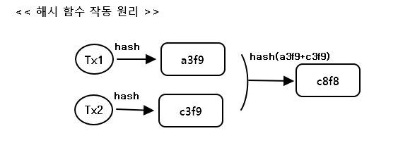  

하위의 Tx1(`a3f9`), Tx2(`c3f9`)의 노드가 있을때 2개의 노드를 다시 암호 해시`hash("a3f9" + c3f9)` 화 하여 새로운 상위 노드를 만든다  

아래와 같이 **머클 트리 구조 및 노드의 추가** 를 그림을 통해 살펴보자  

> 홀수 머클 트리

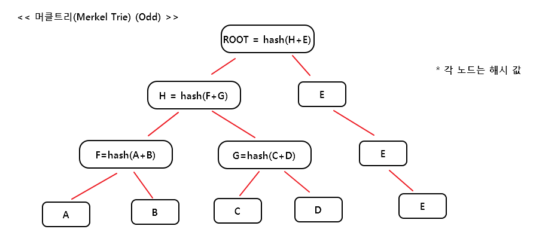  

홀수 일 경우 `[A,B]`, `[C,D]`, `[E]` 이런 식으로 쌍으로 새로운 상위 노드를 만든다.  
마지막에 있는 `E` 노드의 경우 루트 노드를 만들기 전까지 같은 해시값을 사용한다.   

> 짝수 머클 트리  

위에서 새로운 노드 `Z`가 추가 되었다고 가정해보자.  
그러면 아래와 같은 머클 트리를 가지게 된다.

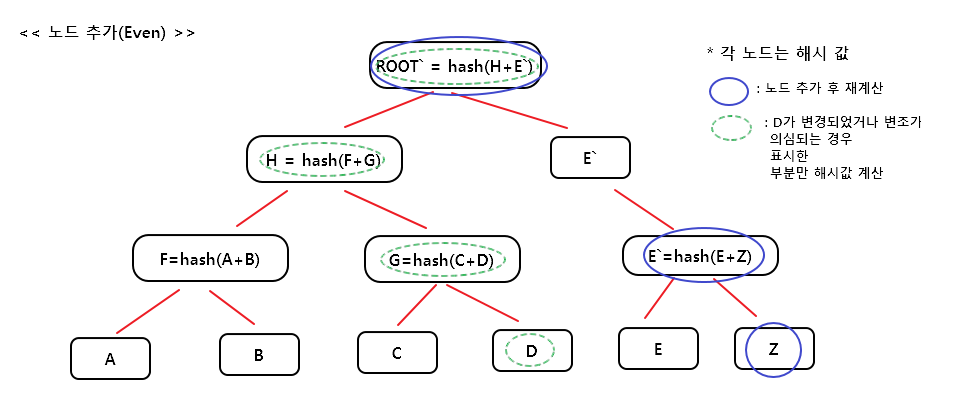  

**Note**  
위의 예제에서 D 노드가 변조 되었을 경우를 고려해보자.  
위에서 초록색으로 칠한 노드만 해시값을 계산하면 된다.  

---  

# 3. 기수 트리  
트라이(trie)는 문자열 집합을 표현하는 트리 자료구조이다.  
또한 기수 트리(Radix tree)는 공간 사용이 최적화된 trie 자료 구조를 의미한다.  

먼저 아래와 같은 `Key(string), Value(int)`의 데이터 셋을 기반으로 살펴보자  

```json
{
  "do"    : 0,
  "dog"   : 1,
  "dax"   : 2,
  "dogu"  : 3,
  "dodo"  : 4,
  "horse" : 5,
  "houses": 6  
}
```  

> ### 기본 기수 트리(Basic Radix Tree)  

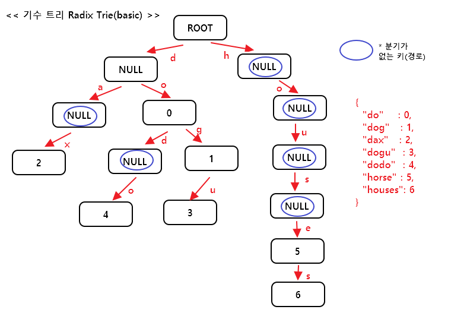  

key 값이 `dog`인 노드를 찾아보면 ROOT를 시작으로 `d` -> `o` -> `g` 노드로  
탐색이 이루어지며 값은 1을 찾을 수 있다.  
하지만 파란색으로 표시한 부분들을 살펴보면 NULL 노드로 공간 낭비가 발생한다.  
분기가 없는 키(파란색 원)을 하나로 합쳐서 트리를 구성하면 아래와 같다.  

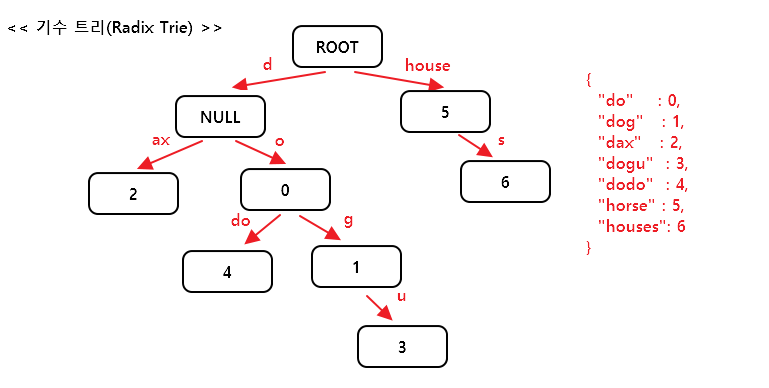  

위와 같이 분기가 없는 부분의 노드를 줄임으로써 공간을 절약할 수 있다.  

---  

# 4. 패트리시아 트리  

아래와 같이 Key,Value로 구성 된 노드와 데이터 셋을 고려해보자  

> ### 노드 구성  

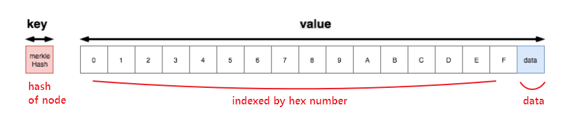  

> ### Key vs Path  

- Key : database lookup
- Path : Trie lookup  
- tdl : this is database lookup
- ttl : this is trie lookup  

> ### 데이터 셋  

```json
{
  "cab8"  : "dog",
  "cabe"  : "cat",
  "39"    : "chicken",  
  "395"   : "duck",
  "56f0"  : "horse"
}
```  

> ### 향상 전 패트리시아 트리  

위의 데이터 셋을 기반으로 구성하면 아래와 같다  

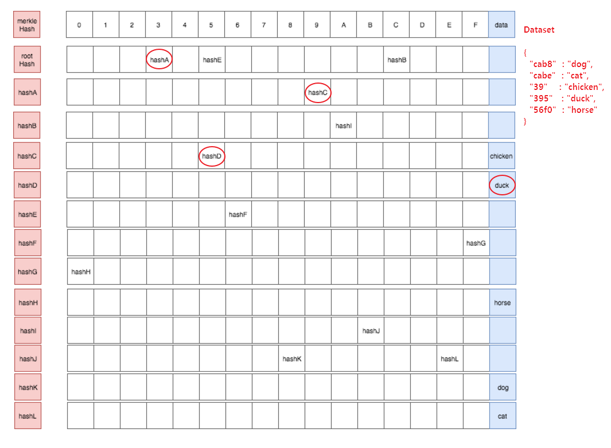  

위의 트리에서 `395` Path에 해당하는 값(`duck`)을 찾는 과정을 살펴보자

1. Key : `rootHash`를 조회 (tdl)  
2. Path : `3` 인덱스를 조회 하면 `hashA` 값을 얻는다(ttl)(*경로 : `395`, 찾은 경로 : `3`, 남은 경로 : `95`*)
3. Key : `hashA`를 조회(tdl)  
4. Path : `9` 인덱스를 조회하면 `hashC` 값을 얻는다(ttl)(*경로 : `395`, 찾은 경로 : `39`, 남은 경로 : `5`*)  
5. Key : `hashC`를 조회(tdl)  
6. Path : `5` 인덱스를 조회하면 `hashD` 값을 얻는다(ttl)(*경로 : `395`, 찾은 경로 : `398`, 남은 경로 : ``*)    
7. path 3개를 모두 탐색했으므로 value 값을 얻을 수 있다.  
=> hashD(ttl)의 Value 부분의 data를 조회하면 `duck` 값을 찾을 수 있다.  

위의 패트리시아 트리에서 Path : `56f0`, Data : `horse`를 찾아보면  
모든 empty node를 탐색하게 된다.  

위의 문제를 2가지 부분 문제로 나눌수가 있다.  

- 끝의 데이터를 가리키는 분기 경로가 없음 => **leaf node**  
(No divergent path points to a data at the end (e.g 56f0))  
- 분기 경로 중 중간에 브런치가 없음 => **extension node**
(No divergent path is branched in the middle (cab of {cabe, cab8}))

> ### leaf, extension node  

**leaf, extension** 노드 정의  

2개의 요소(`{partialPath, value}`)로 이루어진 노드에 대하여  
- `partialPath` : empty value node를 줄이는데 도와준다
- `value` : data if leaf node, merkel hash if extension  

**leaf 노드 추가**  

위의 향상 전 패트리시아 트리에서 `hashE` 값을 leaf 노드로 변경하면 아래의 그림과 같다  

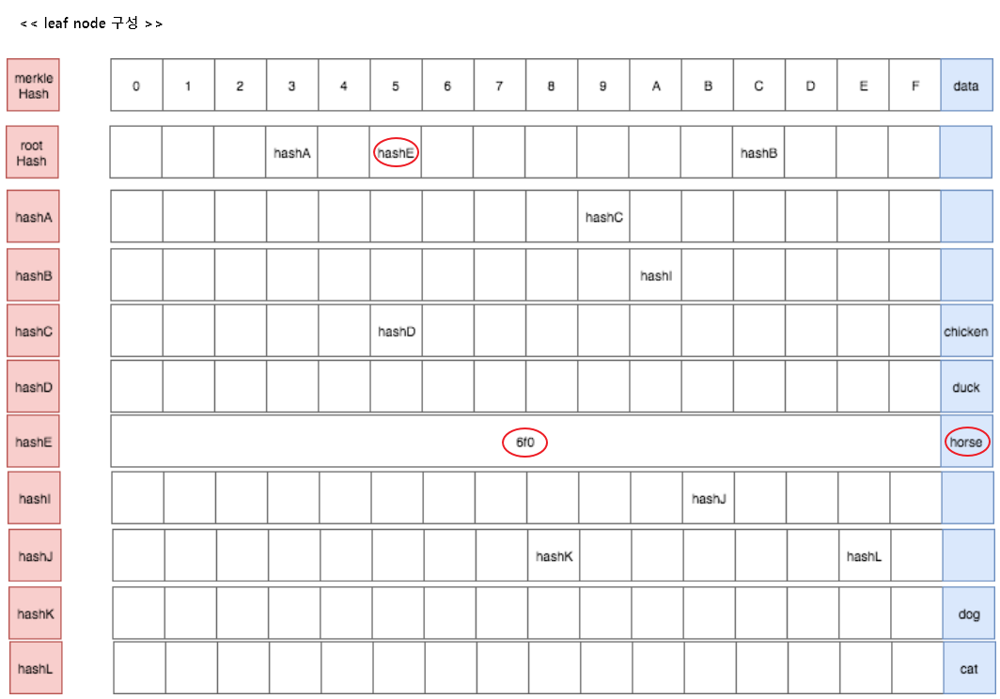  

위와 같이 leaf 노드를 추가한 상태에서 다시 Path `56f0`의 값을 찾아보자  

1. Key : `rootHash` 조회(tdl)  
2. Path : `5` 인덱스를 조회하면 `hashE` 값을 얻는다(ttl)(*경로 : `56f0`, 찾은 경로 : `5`, 남은 경로 : `6f0`*)  
3. Key : `hashE` 조회(tdl)  
3. `hashE`는 leaf (or extension) 노드 이므로 남은 경로(reminder, rest of path) 인  
`6f0 (56f0 - 5)`과 비교  
4. reminder == partialPath가 같으므로 leaf node 이므로 트리의 끝이므로  
해당 노드의 데이터 `hosrse` 값을 찾을 수 있다.  

**extension 노드로 변경**  
기존의 leaf node로 변경된 것에 이어 hashB를 아래와 같이 변경해보자  

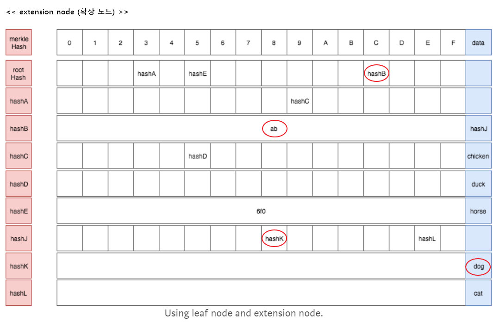  

Path `cab8`의 데이터를 찾아보면,  

1. Key : `rootHash` 조회(tdl)  
2. Path : `c` 인덱스를 조회하면 `hashB` 값을 얻는다(ttl)(*경로 : `cab8`, 찾은 경로 : `c`, 남은 경로 : `ab8`*)  
3. Key : `hashB` 조회(tdl) => extension 노드  
=> 중첩 경로가 `ab`, data가 merkel tree 인 `hashJ`(*경로 : `cab8`, 찾은 경로 : `cab`, 남은 경로 : `8`*)   
4. Key : `hashJ` 조회(tdl)  
5. Path : `8` 인덱스를 조회하면 `hashK` 값을 얻는다(ttl)  
6. Key : `hashK` 조회(tdl)하면 data `dog` 값을 찾을 수 있다  

> ### final optimized (hashK, hashL)  

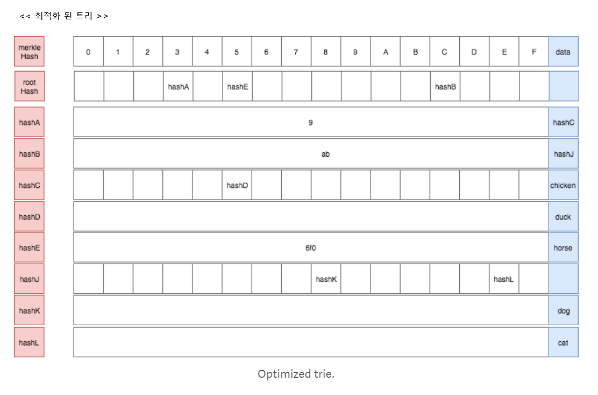  

---  

# 5. 이더리움 패트리시아 트리  

이더리움은 상태 변이 함수인 트랜잭션에 의해 어카운트의 상태가 자주 변경된다.  
위에서 살펴본 머클 트리의 경우 해당 노드의 변경이 이루어지면 연관 된 상위 노드까지 모두  
재계산이 되어야 한다. 이러한 재계산들을 줄이기 위해 이더리움에서는 2가지 추가적인 개선사항을  
도출하였다.  

1. 트리의 깊이를 한정 짓는 것  
트리의 깊이를 한정 짓지 않으면 디도스 공격 등으로 트리를 무한정 깊게 만들어 급격한 성능 저하를  
야기한다
2. 업데이트가 되더라도 머클 루트가 변경되지 않도록 머클 루트에 숫자 값을 주고 이 값에 한정  
되도록 하는 것. 즉 전체 트리를 재계산 하더라도 트리 루트는 변경되지 않는다  

> ### 이더리움의 머클 패트리시아 트리의 주요 특성  

1. 머클 패트리시아 트리 내의 모든 항목은 RLP 인코딩된다

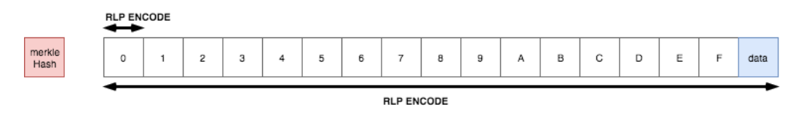  

2. 모든 노드에 대한 경로는 RLP 인코딩 후 keccak256 암호 해시 후 레벨 DB에 저장된다  
머클 패트리시아 루트 노드는 전체 트리에 대해 해시 암호화 된 상태이다  

3. Trie의 성능 향상을 위해 **공백노드(Blank node)**, **리프노드(Leaf node)**,  
**확장 노드(Extension node)**, **브랜치 노드(Branch node)** 라는 4가지 타입을 가진다  

| **공백(Blank) 노드**     | 비어 있는 노드(NULL)                                                                                                                                       |
|--------------------------|------------------------------------------------------------------------------------------------------------------------------------------------------------|
| **리프(Leaf) 노드**      | 일련의 [RLP 인코딩 된 경로, 값]   키 값에 대한 패스가 종결 되었을때   value에 해당 주소에 대한 정보들을 포함                                               |
| **확장(Extension) 노드** | 일련의 [RLP 인코딩된 경로, 키]의 목록   공유되어질 키 값들이 저장되는 노드.   이 노드 자체로 종결되지 않기 때문에 value 로는   이후의 브랜치 노드를 가리킴 |
| **브런치(Branch) 노드**  | [0,...,f,값]으로 17개 항목으로 구성된 리스트 구조 16개의 16진수 값과 value를 가지고 있음. 이 노드를 통해 가지치기가 시작                                   |

4. 리프(Leaf) 노드와 확장(Extension) 노드를 구별하기 위해 선행 구분자를 사용한다  

| **선행 구분자(Prefix)** | **노드 타입** | **경로 값의 길이** |
|-------------------------|---------------|--------------------|
| 0                       | 확장 노드     | 짝수               |
| 1                       | 확장 노드     | 홀수               |
| 2                       | 리프 노드     | 짝수               |
| 3                       | 리프 노드     | 홀수               |

아래와 같이 이더리움의 머클 패트리시아 트리를 살펴보자

  
(https://i.stack.imgur.com/YZGxe.png)  

`a711355` 주소 값에 대한 이더값을 조회해보면,  

1. 확장 노드인 루트 노드는 공통 된 문자열 `a7`을 가지고 있으며 다음 노드로 브랜치 노드를  
가리키고 있다.  
(*Path : `a711355`, Find : `a7`, Reminder : `11355`*)  

2. Branch node의 path `1` 인 인덱스를 살펴보면 리프 노드를 가리키고 있다.  
(*Path : `a711355`, Find : `a71`, Reminder : `1355`*)   

3. Leaf 노드는 종결 노드로써 key-end 값인 `1355`를 가지고 있고 value 값으로  
45 이더를 가지고 있다.
