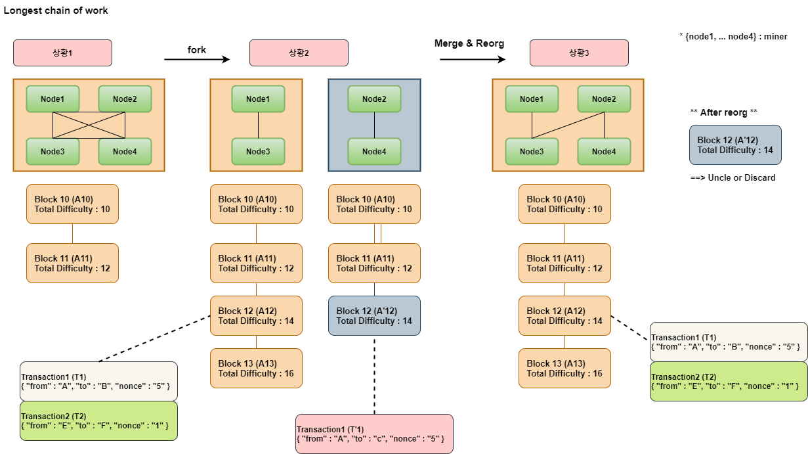
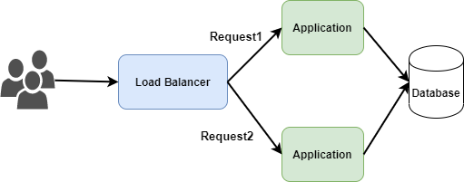
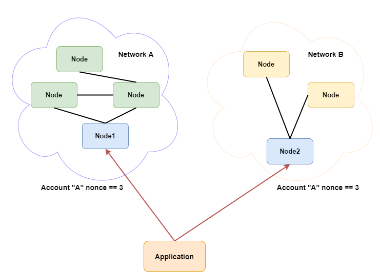
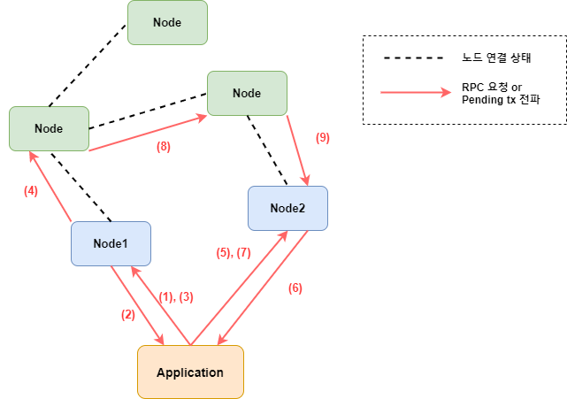

# Application  

- [1. 블록체인의 Finality](#1-블록체인의-Finality)  
- [2. 노드 Route](#2-노드-Route)  
- [3. Node state](#3-Node-state)  

---  

# 1. 블록체인의 Finality  

블록체인에서 Finality란 `Transaction이 절대 되돌려 지거나 수정될 수 없다`는 뜻  

예를들어 아래와 같은 상황1,2,3을 고려해보자  

  

**상황1**  

- Node1, Node2, Node3, Node4 가 모두 연결되어 있는 하나의 체인인 경우  
- 블록 11까지 모두 같은 체인을 가지고 있는 상황

**상황2**  

- {Node1, Node3} 과 {Node2, Node4}만 연결되어 체인이 포크 된 경우 (네트워크 문제 등)
- 두 체인에 모두 주소 “A”로 같은 논스(5)인 트랜잭션 존재 (해시는 다름)

**상황3**  

- Node2 와 Node3이 연결되어 서로의 체인이 병합 후 Reorg 된 경우
  - 가장 긴 체인의 법칙(난이도가 제일 높은) Block13(A13)이 canonical chain
  - Block12(A’12)의 경우 체인의 설정에 따라 엉클블록 OR 버려짐  
  - Transaction1(T’1)의 경우 LocalTransactionPool로 다시 푸쉬 후 같은 논스에 의해 버려짐

**결론**  

위와 같이 노드에게 트랜잭션 요청(`sendRawTransaction`) 후 block에 포함 된 것까지 확인해도  
트랜잭션의 **Finality** 를 보장할 수 없다  

비트코인과 이더리움은 확률적 Finality로 비트코인은 6 confirms(60분), 이더리움은  
25 confirms (6분)의 Confirm 시간이 포함된다  

---  

# 2. 노드 Route  

일반적인 Application은 `Stateless` 이기 때문에 어떠한 Application에게 요청해도 결과 값이  
같다. 그래서 아래 그림과 같이 라운드로빈 같은 순차적인 요청으로 처리해도 된다  

  

하지만 블록체인의 노드는 `State`를 가지고 있기 때문에 적절한 라우팅 작업이 필요하다  

예를들어 아래와 같이 네트워크가 분기(`fork`) 된 상태를 고려해보자  

**Note**  

- 파란색 노드 `Node1`, `Node2`는 사용중인 RPC 노드  
- 녹색 노드는 나눠진 `NetworkA`에 포함 된 다른 노드
- 노란색 노드는 나눠진 `NetowrkB`에 포함 된 다른 노드


  

라운드로빈 방식(첫번째 `Node1`, 두번째 `Node2`)으로 `A` 사용자의 트랜잭션을 2개 요청해보자  

- 1. `Node1`에게 `transactionCount("A","pending")` 요청으로 얻은 `nonce` 값은 `4`  
  - 1.1 `nonce` 값 `4`로 트랜잭션 서명 후 요청
- 2. `Node2`에게 `transactionCount("A","pending")` 요청으로 얻은 `nonce` 값은 `4`  
  - 2.1 `nonce` 값 `4`로 트랜잭션 서명 후 요청  
- 3. 결국 두 네트워크가 하나로 되면 하나의 트랜잭션은 discard 된다  

하나의 네트워크에서도 아래와 같은 경우가 발생할 수 있다  
*(아래의 예제는 `from : "A"`에 대하여 2개의 트랜잭션을 요청하기 위해 라운드 로빈 방식으로  
`Node1`, `Node2`에게 각각 트랜잭션을 요청)*  

**Note**  

- 노드의 tx pool에서 같은 `nonce`의 트랜잭션이 있을때, 가스 가격등을 비교하여  
더 좋은 트랜잭션으로 `replace` 될 수 있다.  
  - 예를들어 처음에 `{nonce : 4, gasPrice: 10}=hashA` 요청 후 `{nonce : 4, gasPrice : 50}=hashB`로 요청을 하면 `hashB` 트랜잭션으로 대체된다


  

- (1) : `Node1`에게 `transactionCount("A", "pending")` 조회  
- (2) : `nonce : 4` 응답
- (3) : `Node1`에게 `Transaction{from : "A", nonce: 4}` 로 요청  
- (4) : `Node1`이 다른 `Node`에게 Pending transaction 전파  
- (5) : `Node2`에게 `transactionCount("A", "pending")` 조회  
- (6) : `nonce : 4` 응답 (아직 Pending transaction 전파 받지 못함)  
- (7) : `Node2`에게 `Transaction{from : "A", nonce: 4}` 로 요청  
- (8), (9) : Pending transaction이 `Node2`에게 전파되는 과정  
- (10) : `Node2`는 현재 local tx에 `"A"`주소의 `nonce==4`인 트랜잭션이 존재하므로 가스 가격을 비교하여 더 적절한 트랜잭션을 선택  

**결론**  

블록체인의 노드는 `State(블록체인, Local tx pool 등)`를 가지고 있으므로 일반적인 로드밸런싱 방식으로 RPC 요청을 할 수 없다  

---  

# 3. Node state  

일반적으로 Application의 Health 상태는 `UP` / `DOWN` 2가지로 나타낼 수 있지만,  

이더리움의 노드에서는 `SYNCING`, `SYNCHRONIZED` 상태가 더 존재한다  
각각의 노드가 블록체인 정보를 가지고 있어야 하기 때문에 노드를 껐다가 일정 시간 뒤에  
다시 시작하거나 다른 체인(Forked)에서 합류할 경우 Reoragnization 작업이 발생하는 등  
다양한 이유로 동기화 작업이 발생할 수 있다  

`eth_syncing` RPC 요청으로 `SYNCING`/`SYNCHRONIZED`를 알 수 있다.  

> SYNCING 상태

```json
{
  "id":1,
  "jsonrpc": "2.0",
  "result": {
    "startingBlock": "0x384",
    "currentBlock": "0x386",
    "highestBlock": "0x454"
  }
}
```

> SYNCHRONIZED 상태

```json
{
  "id":1,
  "jsonrpc": "2.0",
  "result": false
}
```  

*만약 Health check type을 동기화 완료(`SYNCHRONIZED`)로 체크하면 수시로 UP/DOWN 상태가 변경될 수 있다*  

또한 그 외에도 네트워크 상태에 따라 `Canonical chain`과 `Forked chain` 상태가 존재할 수 있다  
예를들어 `NetworkA`의 Block의 `totalDifficulty`는 10, `NetworkB`의 Block의 `totalDifficulty`는  
5일 경우 `NetworkA`가 Main chain인 `Canonical chain`가 된다  
만약 `NetworkB`에서 더 많은 Miner가 블록을 생성하여 체인의 전체 난이도가 올라간다면 Main chain은 바뀔수 있다  
