# 하이퍼레저 구성요소  

- <a href="#references">References</div>  
- <a href="#peer">Peer</div>  
- <a href="#chaincode">Chaincode</div>  
- <a href="#dapp">Dapp</div>  
- <a href="#endorsement_policy">Endorsement Policy</div>  
- <a href="#organization">Organization</div>  
- <a href="#channel">Channel</div>  
- <a href="#ledger">Ledger</div>  
- <a href="#world-state">World State</div>  
- <a href="#blockchain">Block & Blockchain</div>  
- <a href="#gossip">Gossip</div>  
- <a href="#identity">Identity</div>  
- <a href="#ca">CA</div>  
- <a href="#orderer">Orderer</div>  

---  

<div id="references"></div>  

## Reference  

- https://book.naver.com/bookdb/book_detail.nhn?bid=14204645  
(초기 버전은 위의 책의 내용을 정리하였습니다. 추후 도큐먼트에서 내용을 추가할 예정)
- https://hyperledger-fabric.readthedocs.io/en/release-1.3/

---  


<div id="peer"></div>  

## Peer  
=> 패브릭 블록체인을 구성하는 네트워크 노드 중 하나  
=> 분산원장과 스마트 컨트랙트를 관리하는 역할  

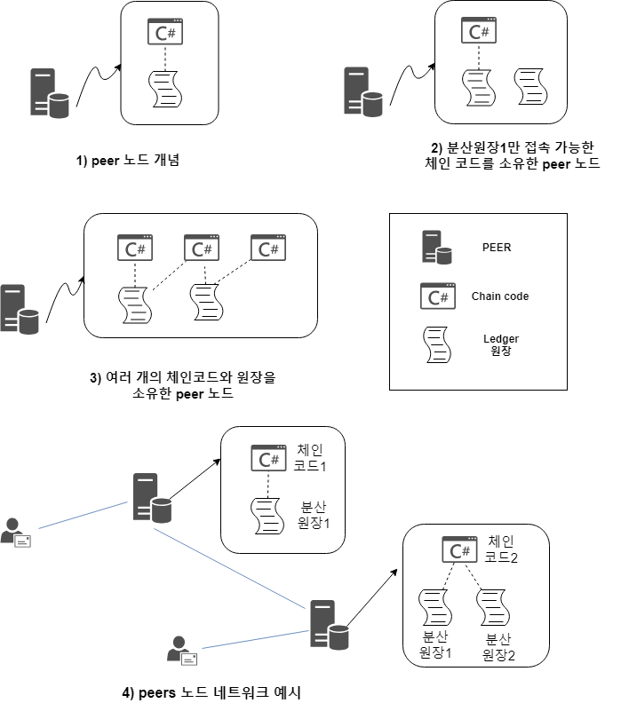  

1. 분산원장과 체인코드는 peer에 저장되고 설치되기 때문에 peer를 통해서만 분장원장과  
체인 코드에 접근할 수 있음  

2. 분산원장에 접근 가능한 체인코드가 없는 경우도 가능하지만, 권장하지 않는 설정  
=> 하나의 peer는 최소 한 개 이상의 분산원장과 체인코드 호스팅을 권장  

3. 필요에 따라 peer는 복수 개의 분산원장과 체인코드를 가질 수 있음  
(위는 2개의 분산원장과 3개의 체인코드를 각각 호스팅)  

4. peer1은 체인코드1과 분산원장1을 호스팅.  
peer2는 체인코드2와 분산원장1, 분산원장2를 호스팅  
=> 사용자A는 peer1에 연결되어 있으며 체인코드1을 통해 데이터를 READ/WRITE  
=> 사용자B는 peer2에 연결되어 있으며 체인코드2를 통해 분산원장1과 분산원장2에  
모두 접근 가능.

---  

<div id="chaincode"></div>  

## Chaincode  
; 분산원장에 데이터를 기록하거나 읽기 위해서 체인코드(chaincode)가 필요  
=> 주로 비즈니스 모델에 맞는 분산 애플리케이션(DApp)과 함께 개발되어 사용  

- 시스템 체인코드(System chaincode)  
; 일반적인 체인코드와는 달리 하이퍼레저 패브릭의 시스템레벨에서 수행되는 체인코드  
=> 시스템 체인코드는 하이퍼레저 패브릭 상에서 기본적으로 제공하는 체인코드이며,  
5가지 종류가 존재  

1. QSCC(Query System ChainCode)  
; 블록체인의 저장된 데이터를 읽어올 때 사용되는 시스템 체인코드  
e.g) GetChainInfo, GetTransactionByID, ...  

2. ESCC(Endorsement System ChainCode)  
; 보증 정책을 담당하는 시스템 체인코드  
=> 사용자의 트랜잭션 실행 결괏값을 비교해 올바르면 자신의 인증서를 통해  
해당 트랜잭션 결괏값에 대한 보증을 함  

3. VSCC(Validation System ChainCode)   
; 블록을 검증할 때 사용되는 시스템 체인코드  
=> Committing peer는 VSCC를 실행하여 트랜잭션의 Read/Write Set과 보증 정책에  
맞게 Endorsing peer의 디지털 인증서의 존재 여부를 확인하는 작업을 수행  
(기본적으로 시스템에서 제공하는 VSCC 체인코드를 사용하지만, 수정해서 사용할 수 있음)  

4. CSCC(Configuration System ChainCode)  
; 채널 설정 시 사용되는 시스템 체인코드  
=> 블록에 대한 정보를 읽어오거나 수정할 수 있으며 peer를 채널에 참여시키는 기능  
등을 제공.  
=> 사용자에게 꼭 결과값을 반환 할 필요X
(peer channel create/join/...)  


5. LSCC(Lifecycle System ChainCode)  
; 체인코드의 설치부터 인스턴스화까지 모든 일련의 과정을 수행하는 데 사용되는 체인코드  
=> 사용자에게 꼭 결과값을 반환 할 필요X  
e.g) peer chaincode install/instantiate  

---  

<div id="dapp"></div>  

## Dapp  
; 체인코드는 그 자체로도 사용가능하지만, 비즈니스 모델에 맞는 분산 애플리케이션(dapp)  
과 함께 개발되어 사용됨  

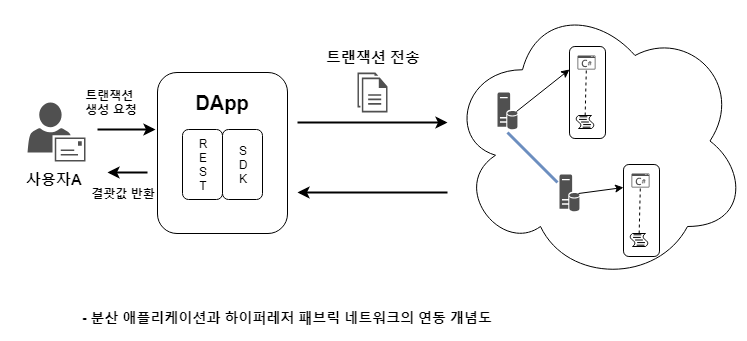  
=> 사용자A는 DApp을 통해 peer 네트워크에 설치 된 체인코드를 실행할 수 있음  
=> 체인코드 기능은 크게 읽기(query) / 쓰기(write/update) 두 종류의 함수로 구분  
=> 읽기 함수는 5단계 과정 / 쓰기 함수는 9단계 과정을 거쳐서 실행 됨  
=> 읽기는 작업을 수행함과 동시에 결괏값을 수신받을 수 있지만, 쓰기는 일정 시간이  
경과된 후에야 결괏값이 반영  

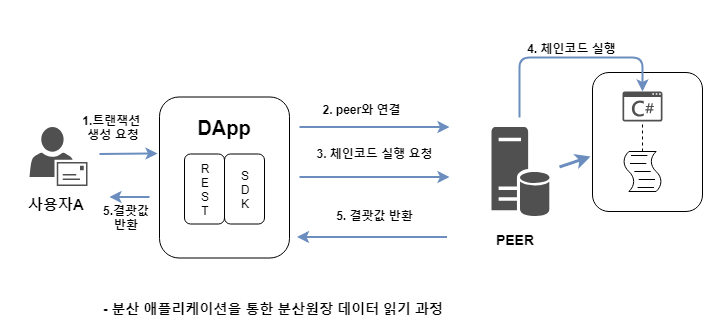  
=> 사용자A의 인증서를 이용해서 인증 과정을 통과한 후 peer와 연결  
=> peer에 설치 된 체인코드의 query 함수를 호출  
=> peer는 요청 받은 체인코드의 query 함수를 실행하여 로컬 저장소에 저장되어 있는  
분산원장의 데이터를 분산 애플리케이션에 전달  
=> 다른 peer는 query 함수 실행을 위한 어떠한 동작도 하지 않음  

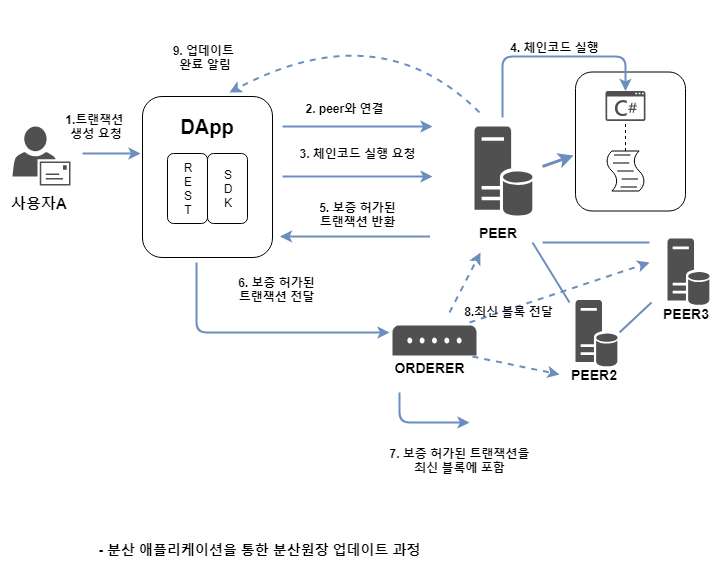  
=> read와 달리 peer 간 합의 과정이 필요하기 때문에 모든 peer가 쓰기 과정에  
참여해야 함  
=> 1~4단계는 read와 같음  

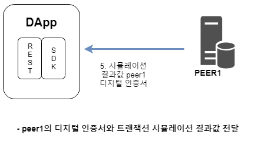  
=> 5단계에서는 peer1이 트랜잭션 입력값에 대한 결괏값과 보증 정책을 확인하는 작업을  
수행  
=> 트랜잭션 실행 결괏값이 정상적이고 peer1의 보증 조건을 충족시키면,  
peer1은 결괏값과 함께 peer1의 디지털 인증서를 분산 애플리케이션에 전달  


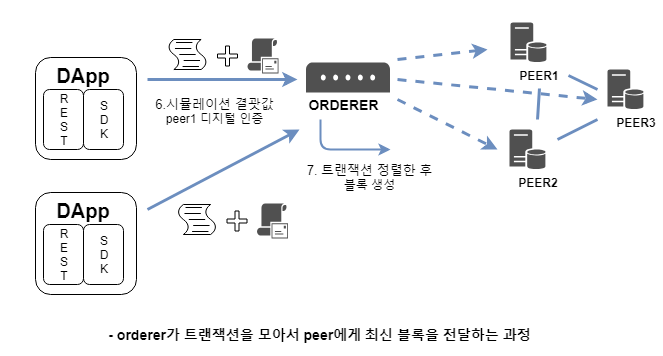  
=> DApp은 트랜잭션 결괏값과 peer1의 디지털 인증서와 함께 트랜잭션을 orderer로 전송  
=> orderer 노드는 자신이 속한 네트워크에서 발생한 모든 트랜잭션을 수신하게 됨  
=> orderer 노드는 수신한 트랜잭션을 순서에 맞게 정렬하여 블록체인의 최신 블록 생성  
후 자신이 속한 네트워크의 모든 peer에게 전달  


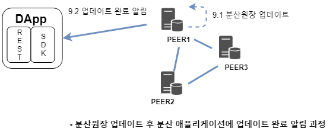  
=> 최신 블록을 전달받은 모든 peer는 해당 블록에 포함 된 모든 트랜잭션에 대한 결괏값과  
인증서를 검증하는 작업을 수행  
=> 검증 과정에서 문제가 없을 시 자신의 로컬 저장소에 저장된 분산원장을 업데이트  
=> peer는 블록 업데이트 결과를 DApp에게 알려주는 것으로 업데이트 과정이 끝  

---  

<div id="endorsement_policy"></div>

## Endorsement Policy  
; 보증 정책(Endorsement Policy)는 트랜잭션을 생성하는 클라이언트(DApp)과  
peer 간에 작용  
=> 보증 정책을 충족시키지 못하면 태그(invalid tag)와 함께 트랜잭션이 기록되고  
해당 트랜잭션은 앞으로의 거래에 영향X  

> ### e.g  

1. 보증 그룹 = {peer1, peer2, peer3, peer4, peer5, peer6, peer7} 일 때,  
아래와 같이 설정할 수 있음
  - 보증 그룹의 모든 peer의 디지털 인증서를 획득해야 함  
  - 보증 그룹의 peer 중 1대의 peer의 디지털 인증서를 획득해야 함  
  - {peer1 OR peer2} AND {any two of peer5, peer6, peer7}  

2. 보증 그룹 = {peer1=15, peer2=10, peer3=25, peer4=20,  
  peer5=10, peer6=10, peer7=10} 일때 아래와 같이 설정 가능  
  - 가중치 합계 50 이상의 peer들로부터 디지털 인증서를 획득해야 함  
  - {peer1 OR peer3} AND {가중치 40이상}  

---  

<div id="organization"></div>  

## Organization

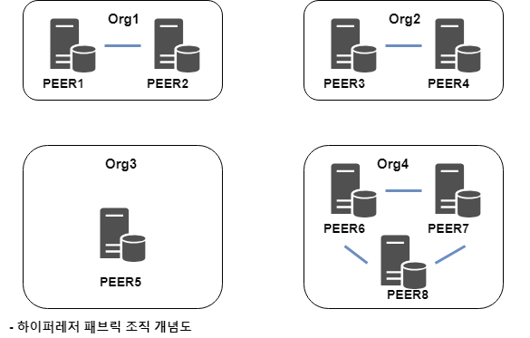   

=> 4개의 조직(Org1~4) 비즈니스 네트워크 구축  
=> 각 조직은 자신의 데이터센터에 peer 노드 설치  
=> 트랜잭션 보증과 블록에 대한 검증을 하는 peer 노드를 각 조직마다  
소유하고 있기 때문에 어느 한 조직에서 분산원장에 대한 기록을 독단적으로  
변경하거나 조작하는 것이 불가능  

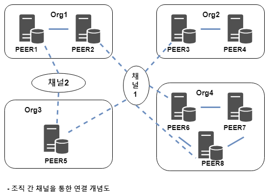   

=> 분산 원장은 각 채널마다 존재
=> 채널2의 분산원장은 PEER1, PEER5  
=> 채널1의 분산원장은 PEER2, PEER5, PEER3, PEER6  
=> 나머지는 X  

=> 위의 예처럼 모든 조직이 채널1에 참여하여 데이터를 공유하고, 채널2처럼 Org1과  
Org3만 서로 데이터를 공유할 수 있는 채널2를 생성할 수도 있음  
=> PEER5는 채널2의 데이터를 채널1 참여자 등에게 공유할 수 없음  

---  

<div id="channel"></div>  

## Channel  

=> 채널 생성은 CSCC(Configuration System ChainCode)를 호출하여 생성할 수 있음  
=> 채널 생성 시 해당 채널에서 사용될 분산원장의 genesis block이 생성됨  
=> genesis block에는 채널 구성원, 채널 정책, 각 peer의 역할 등과 같은 설정이  
포함되어 있음  

---  

<div id="ledger"></div>  

## Ledger  

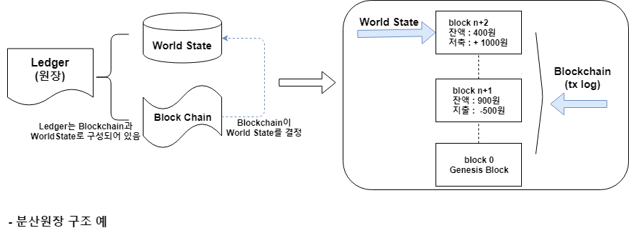  

=> **World state** : 현재 상태를 나타내는 / **Block chain** : 사용 기록을 저장  

- World state에 저장된 데이터는 합의 과정에 의해 블록체인에 포함되기 전까지  
체인코드를 통해 조회/변경/삭제가 가능  
- 합의에 의해 결정된 블록 및 블록체인은 절대 수정X  
- World State는 데이터의 기록,수정,읽기 등이 빈번하므로 (분산) 데이터 베이스로 구축  
(LevelDB or CouchDB 지원)  
- 블록체인은 데이터 요청이 거의 없고, append-only 방식의 저장이 목적이기 때문에  
파일시스템 형태로 저장되어 있음  

---  

<div id="world-state"></div>  

## World State  

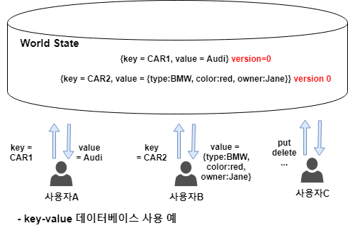  

=> World State는 현재 값을 관리하는 데이터베이스  
=> key-value의 LevelDB와 JSON 포맷의 CouchDB 중 하나를 선택해서 구축  
=> version은 World State가 업데이트될 때마다 증가  
=> peer는 World State를 업데이트 하기 전 트랜잭션과 World State의  
version 값을 비교하는 작업 수행  

e.g) 1년전 잔액 1000원(version 0) & 현재 잔액 100원 (version 1) 일때, 1년전 잔액  
을 기준으로 출금 X  

---  

<div id="blockchain"></div>  

## Block & Blockchain

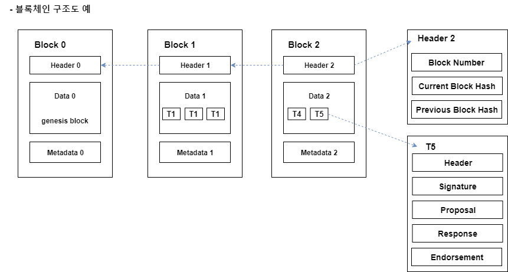  

**Block Header**  

- Block number  
; 0부터 시작(genesis)하여 합의 과정에 의해 블록이 생성될 때마다 1씩 증가  
- Current Block Hash  
; 현재 블록에 포함되어있는 트랜잭션들의 해시값  
- Previous Block Hash  
; 이전 블록에 대한 해시값  

**Block data**  
: 해당 블록에 포함 된 트랜잭션이 순서대로 저장  

**Block metadata**  
; 블록 생성자의 Identity 정보, 블록에 포함되어 있는 Transaction 보증 여부 등이 포함

**Transaction**  

- Header  
; 트랜잭션의 version 정보와 트랜잭션이 실행되는 체인코드의 이름 등이 명시  
- Signature  
; 트랜잭션 생성자의 Identity 관련 디지털 인증서 정보가 존재  
- Proposal  
; 체인코드에 들어가는 트랜잭션의 입력값이 저장되어 있음  
=> 해당 입력값을 이용해서 체인코드를 실행  
- Response  
; 트랜잭션 처리 결괏값을 Read/Write set)형태로 반환하는 필드  
=> Read == 트랜잭션의 Proposal이 반영되기 전 값 / Write == 반영된 후의 값  
```
e.g) 사용자A의 잔고 1000 -> 100 추가  
Read - {사용자A(key), 1000(value), 3(version)}
Write - {사용자A(key), 1100(value)}
```  
- Endorsement  
; 트랜잭션을 보증해 준 peer의 Identity 정보가 포함되어 있음  
=> 보증 정책에 따라서 한 개 혹은 여러 개가 포함될 수 있음  
- Chaincode name  
; 트랜잭션이 실행되는 체인코드를 구분하는 데 사용  
=> peer가 트랜잭션을 입력받으면 Chaincode name이 가리키는 체인코드를 실행  
- 이외 Timestamp, TxId, PayloadVisibility

---  

<div id="gossip"></div>  

## Gossip  

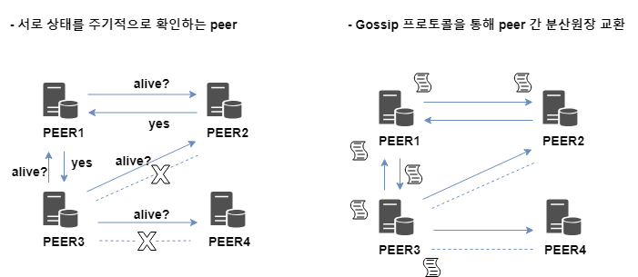  

- peer는 끊임없이 브로드캐스트 메시지를 생성하여 동일한 채널에 있는 peer들의  
상태를 확인  
=> 응답하지 못한 peer는 오프라인 상태로 인식(e.g PEER4)  
=> PEER2는 PEER3에게 응답하지 못했지만 PEER1을 통해 살아있음 으로 인식  

- peer는 Gossip 프로토콜을 통해 같은 채널 내 peer들을 랜덤하게 선택하여  
분산 원장을 전송  
=> Gossip 프로토콜을 통해 분산원장을 수신한 peer는 자신의 분산원장과 비교하여  
업데이트된 최신 정보가 있으면 자신의 분산원장에 해당 내용 업데이트  
=> peer2와 3이 단절되었지만, peer1을 통해 업데이트 가능 BUT peer4는 업데이트X  

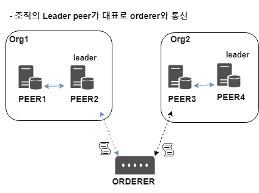  

=> 모든 peer가 order로 부터 분산원장 업데이트 요청하면 orderer가 과부화될 가능성이 큼  
=> Leader peer를 대표로 선출하여 orderer와 통신을 하게 됨  
=> Leader peer는 수동 or 자동으로 선출 될 수 있음  
=> LEader peer는 같은 조직의 peer에게 heatbeat 메시지를 주기적으로 보내어  
자신이 살아있음을 증명  
=> 하나 이상의 peer가 특정 시간 동안 heartbeat 메시지를 수신하지 못하면 새로운 Leader 선출  
=> 네트워크 장애로 인해 2개의 조직으로 나눠지는 경우 2대 이상의 Leader peer가 존재할 수  
있음(복구 후 다시 하나만 Leader peer)  
=> Leader peer 뿐만 아니라 모든 peer는 자신의 시스템 상태를 알리기 위해 heartbeat를  
브로드캐스트 함  
e.g) 같은 채널에 소속된 peer 중 특정 peer로부터 일정 시간 동안 heartbeat 메시지가 수신  
되지 않으면 해당 peer는 죽은 거승로 간주되어 채널 멤버십에서 제외됨  

---  

<div id="identity"></div>

## Identity  
; peer, orderer, client 등 다양한 종류의 네트워크 노드는 PIK(Public Key Infrastructure)  
기반의 디지털 인증서를 이용하여 신원 확인  
=> 디지털 인증서는 cryptogen, Fabric-CA를 이용하여 생성  

=> PKI는 넓은 의미로 디지털 인증서를 안전하게 제공/생성/관리하는 기술  
=> PKI는 CA(Certificate Authority)라고 불리는 네트워크 노드하에 관리됨  

> ### 디지털 인증서  

=> PKI는 X.509 디지털 인증서(ITU-T에서 정의한 국제 표준)를 사용  
<table>
  <tr>
    <th>Certificate Format Version</th>
    <td>
    인증서의 버전 정보 표시(현재는 version3까지 있음)      
    </td>
  </tr>
  <tr>
    <th>Certificate Serial Number</th>
    <td>
    인증서를 구분하는 시리얼 번호(최대 20octet)      
    </td>
  </tr>  
  <tr>
    <th>Certificate Algorithm Identifier for CA</th>
    <td>
    인증서의 위/변조를 방지하기 위해 사용되는 암호화 알고리즘을 표시  
    (version3은 SHA-256 with RSA 사용)
    </td>
  </tr>
  <tr>
    <th>Issuer Name</th>
    <td>
    인증서를 발급한 CA의 정보
    </td>
  </tr>
  <tr>
    <th>Validity Period</th>
    <td>
    인증서 유효기간의 시작일과 만료일
    </td>
  </tr>
  <tr>
    <th>Subject Name</th>
    <td>
    인증서 사용자 정보
    </td>
  </tr>
  <tr>
    <th>Subject Public Key Information</th>
    <td>
    인증서 사용자 공개키
    </td>
  </tr>
  <tr>
    <th>Extension(s)(V3)</th>
    <td>
    인증서의 추가적인 정보와 정책(version3에서 사용 가능)
    </td>
  </tr>
  <tr>
    <th>CA Signature</th>
    <td>
    CA의 디지털 인증서
    </td>
  </tr>
</table>  

> ### 공개키(Public Key) / 비밀키(Private Key)  

=> 데이터가 위/변조 되지 않음을 보장하는 무결성은 통신에서 굉장히 중요한 요소  
=> 무결성을 증명하기 위해 가장 기본이 되는 것이 **신원 인증** 과 **데이터 암호화**  

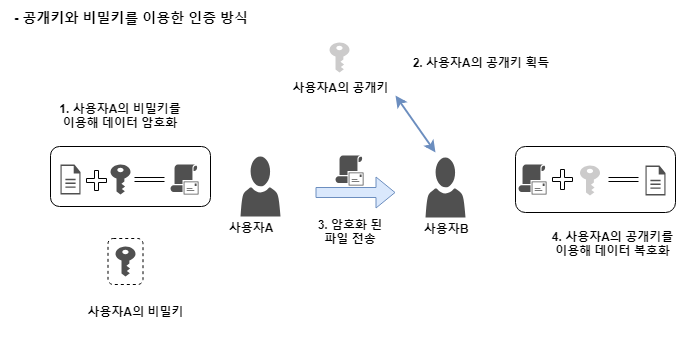  

=> 사용자A는 비밀키로 데이터를 암호화  
=> 사용자B는 사용자A의 공개키로 복호화(복호화 안되면 인증X)  

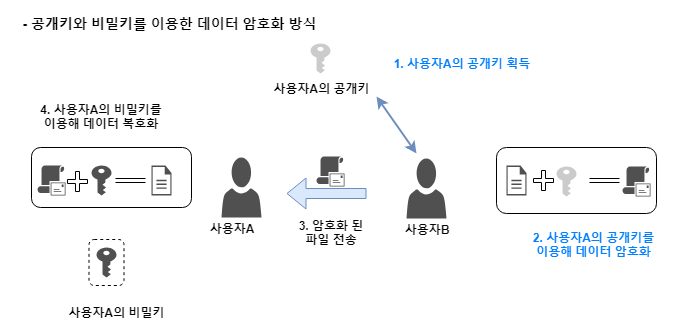  

=> 사용자B는 사용자A의 공개키 획득 후 데이터 암호화  
=> 사용자A는 개인키를 이용하여 데이터 복호화  

- 공개키를 이용해 암호화를 수행하면 원하는 상대에게만 데이터를 공개할 수 있음
- 비밀키를 이용해 암호화를 수행하면 신원 인증을 할 수 있음  

> ### CA(Certificate Authority)  

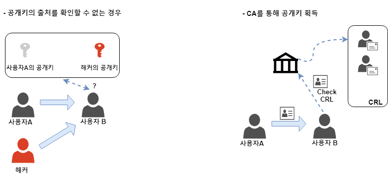  

=> 왼쪽 MITM(중간자 공격, Man in Middle Attack)  
=> 사용자B는 CA에게 사용자A의 공개키를 요청  
=> CA는 암호화 기법을 통해 안전하게 사용자A의 공개키를 사용자B에게 전달  
=> Fabric-CA 노드가 CA 역할을 담당  
=> 기존의 CA와 마찬가지로 X.509 인증서를 발급하고 관리할 수 있을 뿐만 아니라  
하이퍼레저 패브릭 네트워크 구성을 위한 특화된 기능도 몇 가지 제공  

> ### Certificate Revocation List  

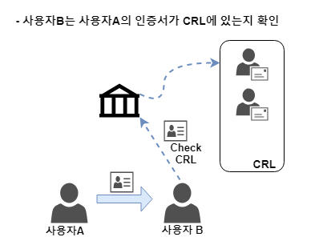  

=> CRL은 폐기된 인증서에 대한 목록  
=> 사용자B는 사용자A로부터 인증서를 받으면 CA의 CRL에 해당 인증서가 존재하는지  
확인하는 작업  
=> 사용자B는 해당 인증서가 존재하지 않으면, 올바른 사용자로 판단하고 인증 절차를 수행  

---  

<div id="msp"></div>  

## MSP(Membership Service Provider)  
: Identity 기술을 바탕으로 만든 하이퍼레저 패브릭 맴버십 관리 기술  
=> MSP를 이용해 peer, orderer, Fabric-CA, Admin 등의 역할과 소속, 권한 등을 정의  

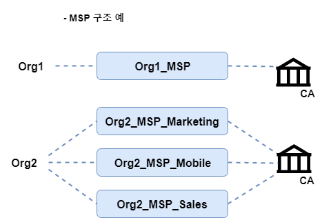  

- Org1 처럼 단순하게 조직 당 하나의 MSP가 있는 구조
- Org2 처럼 하나의 조직에 다수의 MSP가 존재  
=> CA는 X.509 디지털 인증서의 OU(Organizational Unit) 필드를 이용하여 세분화된  
조직의 MSP를 위한 디지털 인증서를 발급할 수 있음  

**local MSP**  
; 하이퍼레저 패브릭 네트워크 노드의 역할을 부여할 때 사용하는 MSP  
=> local MSP를 통해 어떤 노드가 peer, orderer, client인지 정의할 수 있고,  
client가 Admin인지 일반 유저인지 등의 노드별 권한도 정의할 수 있음  
=> 모든 네트워크는 하나 이상의 local MSP가 존재해야 함  

**Channel MSP**  
; 채널 구성원들에 대한 멤버십 정의와 권한을 부여할 때 사용  
=> 채널에 참여한 구성원들은 각자의 local MSP를 이용해 하나의 channel MSP를 생성  

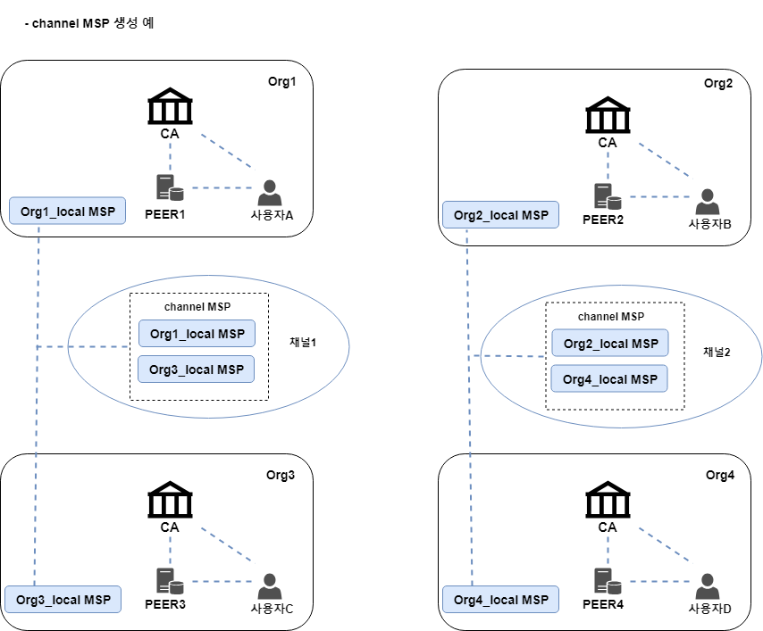  

=> Org1 ~ Org4 까지 4개의 조직이 존재 & 각 조직의 peer와 사용자는 CA로부터  
발급 받은 local MSP가 존재  
=> Org1 - Org3 / Org2 - Org4는 비즈니스 협정을 맺은 후 데이터 공유를 위한 채널1과  
채널2를 생성한다고 가정  
=> Org1과 Org3은 각자의 local MSP를 이용하여 서로 데이터를 공유할 수 있는 channel MSP 생성(Org2-4도 마찬가지)  
=> Org1과 Org3은 채널1에만 접근 가능 & Org2와 Org4는 채널2에만 접근 가능  
=> 각 조직의 사용자는 조직의 CA를 통해 인증서를 생성하고 peer를 통해 조직이 속한 채널에  
체인코드를 설치하거나 실행할 수 있음

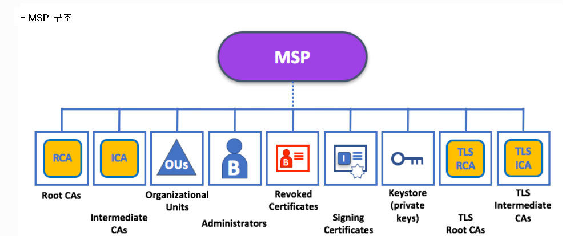  
(https://hyperledger-fabric.readthedocs.io/en/release-1.3/membership/membership.html#msp-levels)  

- Root CA  
; 하이퍼레저 패브릭의 RCA(Root CA) 디지털 인증서를 나타냄  
- Intermediate CA  
; ICA(Intermedidate CA) 디지털 인증서를 나타냄  
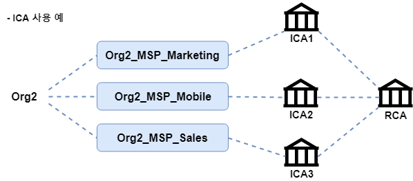    
=> 위 그림과 같이 여러 개의 CA로 구성될 수 있음  
=> 설치와 편의를 위해 Root CA 하나로 관리하는 경우도 있음  

- Organizational Units(OU)  
; ICA를 사용하지 않고 하나의 CA(Root CA)를 이용해 조직을 세분화하고 싶을 때 사용  
=> $FABRIC_CFG_PATH/msp/config.yaml 파일에 OU 관련 정보가 입력 되어 있고  
<code> openssl x509 -in </code> 명령어를 통해 관련내용 확인 가능  

- Administrators  
; 조직 운영자의 인증서를 나타내고 있음. 하이퍼레저 패브릭의 MSP 구조에서는  
조직당 하나 이상의 운영자 인증서가 존재해야 함  
=> 조직의 운영자가 되어도 조직의 모든 시스템 운영 권한이 있는 것은 아님  
위의 그림과 같이 조직을 세분화하여 조직별로 운영자를 만들고 각자의 운영자에게  
역할별로 권한을 나눠 줄 수 있음  

- Revoked Certificate  
; 폐기된 인증서를 나타냄  
=> CRL 검사 시 해당 폴더를 참고  

- Node identity  
; 개인키로 암호화한 인증서를 나타내고 있음  

- Keystore  
; 개인키를 나타내고 있음  

- TLS Root CA  
; 보안 강화를 위해 TLS 기능을 사용할 때 Root CA로부터 발급 받은 TLS 인증서를  
나타내고 있음  
=> TLS 통신은 주로 peer와 orderer 사이에 사용됨  

- TLS Intermediate CA  
; Intermediate CA로부터 발급받은 TLS 인증서를 나타냄  

---  

<div id="orderer"></div>  

## Orderer  

- 1단계 : 트랜잭션 제출
- 2단계 : 블록 패키징
- 3단계 : 검증  

**1단계 : 트랜잭션 제출**  
;DApp에서 트랜잭션 보증을 담당하는 Endorsing peer에게 트랜잭션을 제출하는 것부터  
해당 트랜잭션이 가리키는 체인코드가 실행되기까지가 1단계 과정  

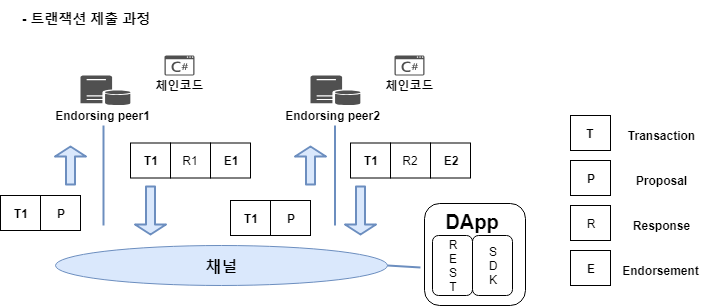  

=> Endorsing peer들은 Proposal 값을 바탕으로 체인코드를 시뮬레이션 하게 됨  
=> 올바른 결괏값이 나오면 자신의 Identity를 이용해 서명한 디지털 인증서와  
Read/Write set을 함께 분산 애플리케이션에 전송  

**2단계 : 블록 패키징**    
; 제출 된 트랜잭션을 orderer가 수집하여 순서대로 정렬한 후 최신 블록을 생성하는 과정  

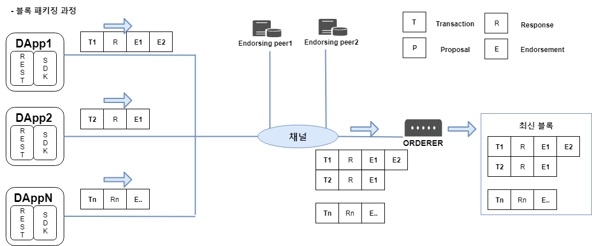  

=> Endorsing peer로부터 받은 Read/Write set과 Endorsing peer의 디지털 인증서를  
트랜잭션과 함께 orderer로 전송  
=> 트랜잭션을 전송받은 orderer는 순서대로 정렬 한 후 최신 블록 생성  

**3단계 : 검증**  
; orderer가 생성한 최신 블록을 각 조직의 peer에게 전달하고 최신 블록을 전달받은 peer는  
해당 블록이 올바르게 생성됐는지 검증하는 과정  

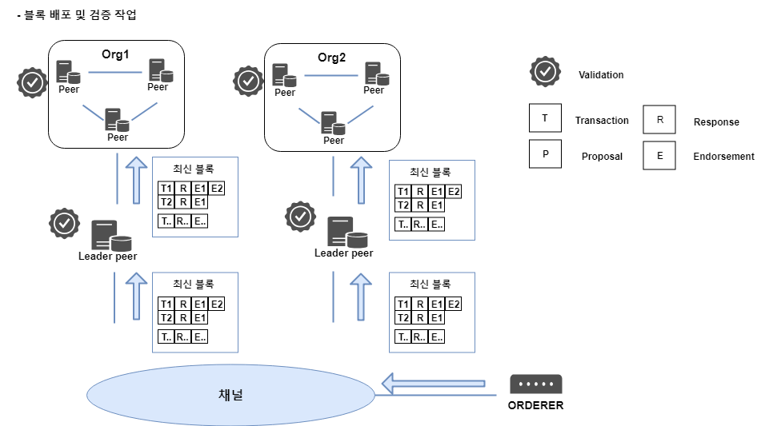  

=> Orderer는 자신이 생성한 최신 블록을 각 조직의 Leader peer에게 전달  
=> 최신 블록을 받은 Peer들은 블록에 포함된 결괏값이 정상적인지 각각의 트랜잭션  
결괏값이 보증 정책에 부합하는지 등의 검증 작업을 수행한 후, 문제가 없을 경우  
자신의 로컬 저장소에 최신 블록 추가 & World state 데이터베이스 업데이트  

=> 하이퍼레저 패브릭의 체인코드는 1단계에서 트랜잭션 실행 요청을 받은 Endorsing peer에  
의해서만 실행됨  

**오더링 서비스**  
; orderer는 트랜잭션을 정렬한 후 최신 블록을 생성  
=> 오더링서비스 기능은 카프카 메시징 시스템을 이용해 구현  

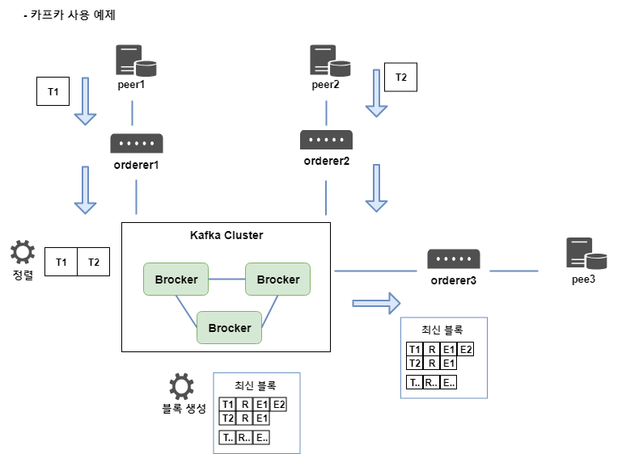  

=> 위의 예제에서 트랜잭션을 전달 받은 orderer가 카프카 클러스터를 통해 블록을  
생성하는 Producer 역할 / 생성 된 블록을 전달받는 orderer가 Consumer 역할  


---  

<br /><br /><br /><br /><br /><br /><br /><br /><br /><br /><br /><br /><br /><br /><br /><br /><br /><br /><br /><br /><br /><br /><br /><br />
