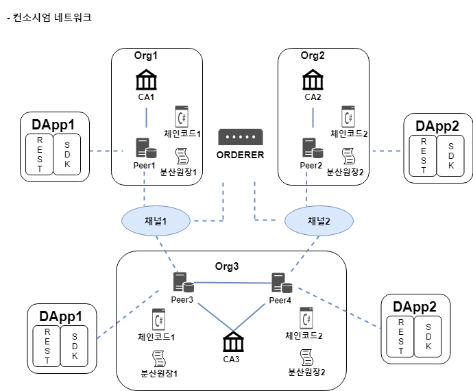

# 02 네트워크 구축 과정  

## References

- https://book.naver.com/bookdb/book_detail.nhn?bid=14204645  
(초기 버전은 위의 책의 내용을 정리하였습니다. 추후 도큐먼트에서 내용을 추가할 예정)  

---  

**컨소시엄(Consortium)**  
; 비슷한 목적을 가진 조직들이 협정을 맺는 것  

> 컨소시엄 네트워크 예제  

  

## 1. 오더링 서비스 노드 구축  

  

=> 참여 조직 간 협의하에 오더링 서비스 노드를 구축한 후 향후 추가 될  
peer, 채널, 클라이언트, 네트워크 정책, 채널 정책 등을 오더링 서비스에 저장 된  
configuration block을 통해 설정할 수 있음  

## 2. 채널 생성  

  

=> 오더링 서비스 노드를 통해 채널1을 생성  
=> 채널1은 컨소시엄을 구성한 조직 중 비즈니스 이해관계가 맞는 조직 간에만  
데이터를 공유하는 기능을 제공  

## 3. 채널 참여  

  

=> Org1과 Org3은 자신의 데이터 센터에 peer를 설치한 후 채널1에 참여 시킴  
=> 채널1에 참여한 peer는 채널1에서 사용되는 분산원장1을 자신의 로컬 저장소에  
저장하고 이를 통해 비즈니스 데이터를 공유할 수 있음  

=> peer는 아래 네 가지 역할 중 하나 이상 선택 가능  

- Committing peer : 최신 블록에 대한 검증 작업을 수행하는 peer  
=> 모든 peer는 Committing peer 역할을 수행해야 함  

- Endorsing peer : DApp에서 제출하는 트랜잭션의 보증 여부를 판단하는 peer  
=> 트랜잭션을 제출하면 입력값을 이용해 체인코드를 시뮬레이션 함  
=> 문제가 없다면 Read/Write set과 함께 자신의 Identity가 포함된 디지털 인증서를  
DApp 으로 보냄  

- Leader peer : 조직의 대표로서 오더링 서비스 노드와 연결되어 최신 블록에 대한  
업데이트를 전달받는 peer  
=> 다른 peer들은 Leader peer로 부터 최신 블록을 전달 받음  

- Anchor peer : 조직의 peer들 중 대표로, 다른 조직에 설치된 peer간의 통신을 담당

## 4. 체인코드/분산 애플리케이션 설치  

  

=> 체인코드는 채널 참여자들의 비즈니스 목적에 맞는 스마트 컨트랙트 기능을 가지고 있고  
(Endorsing)peer에 설치 됨  

## 5. 새로운 조직/채널 추가  

  

=> 오더링 서비스를 통해 새로운 조직(Org2)을 생성하고 채널 정책을 수정한 후 채널2를 생성  

## 6. 새로운 조직의 남은 구성요소 설치  

  

=> Org2는 자신의 데이터센터에 peer를 설치한 후 채널2에 참여 시킴  
=> 채널2 비즈니스 목적에 맞는 체인코드2와 DApp2를 설치  
=> Org2-Org3 비즈니스 협정을 맺었다는 가정하에 Org3은 자신의 peer4를 채널2에 참여  
한 후 체인코드2와 DApp2를 설치  
=> Org2의 peer2와 Org3의 peer4는 분산원장2를 통해서 서로의 비즈니스 데이터를 공유  

---  

## Reference  

- https://book.naver.com/bookdb/book_detail.nhn?bid=14204645  
