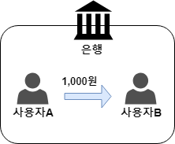
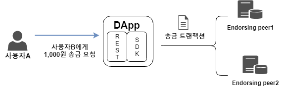
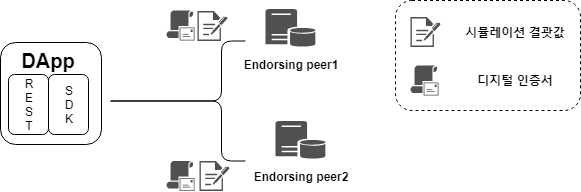
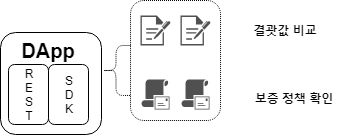
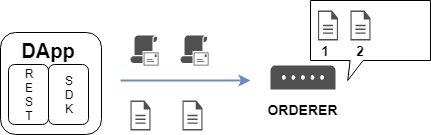
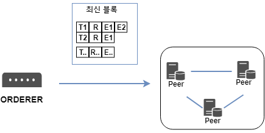

# 트랜잭션 처리 과정 & 합의  

## References

- https://book.naver.com/bookdb/book_detail.nhn?bid=14204645  
(초기 버전은 위의 책의 내용을 정리하였습니다. 추후 도큐먼트에서 내용을 추가할 예정)  

---  

  

=> 은행을 위한 하이퍼레저 패브릭 네트워크 구축, 계좌 이체용 체인코드와  
분산 애플리케이션 개발, 사용자와 은행 간의 디지털 인증서 생성은 이미 완료 되었다고 가정  
하에 **트랜잭션 처리 과정** 을 살펴 볼 예정  

## 1. 트랜잭션 생성  

  

=> 사용자A는 분산 애플리케이션을 통해 사용자B에게 1,000원을 송금하는 트랜잭션  
생성 요청  
=> 트랜잭션 요청을 받은 분산 애플리케이션은 사용자B에게 1,000원을 송금하는 내용의  
트랜잭션을 생성한 뒤 Endorsing peer에게 전송  

## 2. 트랜잭션 보증   

=> Endorsing peer는 아래와 같은 항목을 검증  

- 체인코드 시뮬레이션 결괏값으로 생성된 Read/Write set이 올바른지  
=> 트랜잭션의 Proposal과 Chaincode name 필드, World state 데이터베이스를 참조하여  
체인코드를 시뮬레이션  
- 동일한 트랜잭션이 발생한 적 있는지 여부(리플레이 공격(reply-attack) 방지)  
- 사용자A의 MSP가 유효한지  
- 사용자A가 분산원장 업데이트 권한을 가지고 있는지(channel MSP 확인)  

=> 그 밖에도 이중 지불 방지를 위해 트랜잭션의 version을 확인하고 인증과 권한 확인을 위해  
MSP도 검사  

   

위으 4가지 항목을 검사하고 이상이 없으면 Endorsing peer는 Read/Write set과 자신의 Identity로  
서명한 디지털 인증서를 분산 애플리케이션으로 전송  
=> 보증 정책에 따라서 Endorsing peer의 디지털 인증서는 한 개 혹은 여러 개가 필요하게 됨  
(위의 예제는 Endorsing peer1과 Endorsing peer2에게 보증을 받도록 가정)  

## 3. 시뮬레이션 결괏값/디지털 인증서 확인  

  

- Read/Write set 검사  
  - Read - { (사용자A, 사용자A의 잔액, 현재 State DB의 레코드 버전(현재 블록체인 높이));  
           (사용자B, 사용자B의 잔액, 현재 State DB의 레코드 버전(현재 블록체인의 높이)) }  
  - Write - { (사용자A, 사용자A의 잔액-1,000원); (사용자B, 사용자B의 잔액+1,000원) }  
- 보증 정책을 충족시키는 Endorsing peer의 디지털 인증서가 수신됐는지도 검사  
(위의 경우는 Endorsing peer1과 Endorsing peer2의 디지털 인증서가 있는지 확인하게 됨)  

## 4. 최신 블록 생성  

  

=> DApp은 블록을 생성하기 위해 Read/Write set과 Endorsing peer의 디지털 인증서가  
담긴 트랜잭션을 orderer로 브로드 캐스트  

=> orderer는 트랜잭션 정렬에 필요한 Timestamp 필드 등을 확인한 후 블록에 포함될  
트랜잭션을 정해진 순서대로 정렬하여 최신 블록 생성  

## 5. 최신 블록 검증  

  

=> orderer는 최신 블록을 Committing peer로 전달  
=> Committing peer는 해당 블록을 검증하기 위해 VSCC 시스템 체인코드를 실행하여 블록에 포함 된  
각각의 트랜잭션마다 아래와 같은 작업을 수행  

- **보증 정책 확인**  : 각각의 트랜잭션마다 보증 정책에 부합하는 Endorsing peer의 디지털  
인증서가 존재하는지 확인. 만약 보증 정책을 만족시키지 않는다면 해당 트랜잭션은 부적합(invalid)  
- **Read/Write set 확인** : 각 트랜잭션마다 Read/Write set 결괏값을 확인  
=> Read set에 포함된 키 값이 사용될 때의 State DB의 레코드 버전(블록 버전)을 확인한 후  
현재 블록체인의 버전과 일치하는지 확인  
=> 일치하지 않는다면 해당 트랜잭션은 부적합 판정을 받고 반영X  

=> Committing peer는 위의 검사를 마친 후 트랜잭션 보증 여부에 따라 각 트랜잭션마다  
유효(valid) or 무효(invalid) 태그(tag)를 표시하는 작업을 수행  

## 6. 최신 블록 업데이트  

=> 최신 블록 검증 단계까지 통과하면 peer는 자신의 로컬 저장소에 저장되어 있는 블록체인에  
최신 블록을 추가하여 저장  
=> 유효 태그를 가진 트랜잭션의 내용만을 World state 데이터베이스에 업데이트  
=> 분산원장을 통해 사용자A는 1000원이 감소 된 것을 확인할 수 있고 사용자B는 증가 된 것 확인  

---  

# 합의  

=> 비트코인, 이더리움 등 과 달리, 트랜잭션 생성부터 최신 블록이 peer에 저장되기까지의  
모든 과정을 합의라고 함  

- 보증 정책 확인(Endorsement)  
- 트랜잭션을 정해진 순서에 맞춰 정렬(Ordering)  
- 정렬된 트랜잭션의 유효성 검증 후 최신 블록 업데이트(Validation)  

=> 트랜잭션을 정렬하는 방법은 카프카와 Solo를 지원  
=> 카프카는 트랜잭션을 순차적으로 정렬하고, 여러 개의 노드를 클러스터 형태로 구성하여  
특정 노드에 장애가 발생했을 시 다른 노드가 그 역할을 대신 할 수 있는 장애 허용(crash  
fault tolerance) 트랜잭션 정렬 시스템  
=> Solo는 orderer 한 대가 트랜잭션의 정렬부터 최신 블록 생성까지 모든것을 담당하는 시스템  
