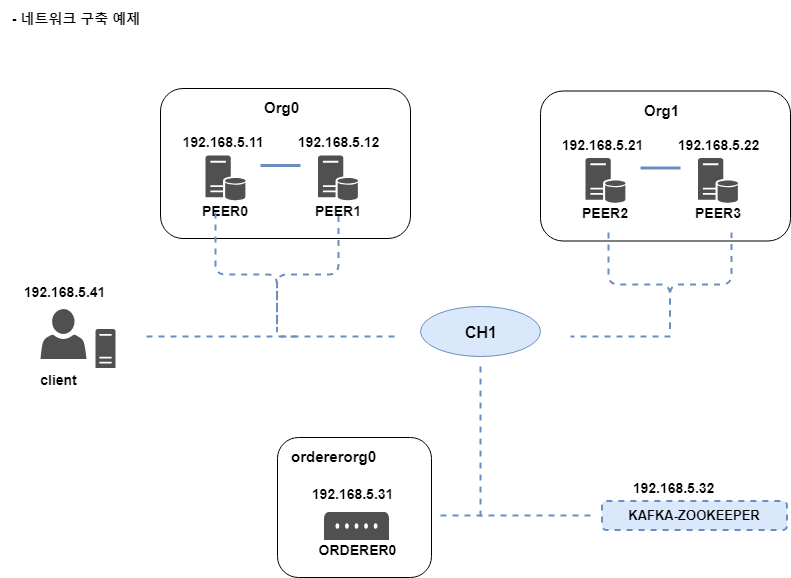

# 네트워크 구축  

- <a href="#example">네트워크 구축 예제</a>
- <a href="#msp">MSP 생성</a>
- <a href="#genesis">Genesis block 생성</a>
- <a href="#channel">채널 설정</a>
- <a href="#deply-MSP">MSP 디렉터리 배포</a>
- <a href="#start_peer">Peer 구동</a>
- <a href="#start_kafka_zookeeper">Kafka zookeeper 구동</a>  
- <a href="#start_orderer">Orderer 구동</a>  
- <a href="#generate_channel">Channel 생성</a>  
- <a href="#join-channel">Peer 채널 참여</a>  
- <a href="#anchor-peer">Anchor peer 업데이트</a>  
- <a href="#chaincode">Chaincode 설치</a>  
- <a href="#chaincode-instance">Chaincode 인스턴스 생성</a>  
- <a href="#read-write-ledger">분산원장 데이터 읽기 및 기록</a>  


---  

<div id="example"></div>

  

> hostname 및 host 파일 설정  

```
root@ubuntu:~# vi /etc/hosts

# Hyperledger
192.168.5.11  peer0
192.168.5.12  peer1

192.168.5.21  peer2
192.168.5.22  peer3

192.168.5.31  orderer0
192.168.5.32  kafka-zookeeper

192.168.5.41  client
```  

---  

<div id="msp"></div>

## MSP 생성  

> testnet/crypto-config.yaml 파일 생성  

```
OrdererOrgs:
  # ordererorg0 이름의 조직 생성
  - Name: OrdererOrg0
    Domain: ordererorg0
    Specs:
      # orderer0 이름의 orderer 노드 생성
      - Hostname: orderer0

PeerOrgs:
  # org0 조직 생성
  - Name: Org0
    Domain: org0
    # peer0, peer1 생성
    Template:
      Count: 2
    # User1 클라이언트 생성
    Users:
      Count: 1

  - Name: Org1
    Domain: org1
    # peer2, peer3 생성
    Template:
      Count: 2
      Start: 2
    # User1 클라이언트 생성
    Users:
      Count: 1
```  

> MSP 생성 명령어(client 노드에서 실행)  

```
root@ubuntu:~/testnet# cryptogen generate --config=./crypto-config.yaml
org0
org1
root@ubuntu:~/testnet# ls
crypto-config  crypto-config.yaml
```  

> tree ./crypto-config  

```
./
├── ordererOrganizations
│   └── ordererorg0
│       ├── ca
│       │   ├── 6183b6b84f1fd42f2abf6d032a2064cfec5f0c9d7a0c04dd65c49b8a3e1d2e34_sk
│       │   └── ca.ordererorg0-cert.pem
│       ├── msp
│       │   ├── admincerts
│       │   │   └── Admin@ordererorg0-cert.pem
│       │   ├── cacerts
│       │   │   └── ca.ordererorg0-cert.pem
│       │   └── tlscacerts
│       │       └── tlsca.ordererorg0-cert.pem
│       ├── orderers
│       │   └── orderer0.ordererorg0
│       │       ├── msp
│       │       │   ├── admincerts
│       │       │   │   └── Admin@ordererorg0-cert.pem
│       │       │   ├── cacerts
│       │       │   │   └── ca.ordererorg0-cert.pem
│       │       │   ├── keystore
│       │       │   │   └── 9d0e146d1efa77b4fb58fd1c97f42b6d296dd166bc0ec350e3fc69fb3447d0d1_sk
│       │       │   ├── signcerts
│       │       │   │   └── orderer0.ordererorg0-cert.pem
│       │       │   └── tlscacerts
│       │       │       └── tlsca.ordererorg0-cert.pem
│       │       └── tls
│       │           ├── ca.crt
│       │           ├── server.crt
│       │           └── server.key
│       ├── tlsca
│       │   ├── 5690a9ac3a141afd4ffad2e1a3bd865f4da19df42bd718f401db6aa3e0eed69b_sk
│       │   └── tlsca.ordererorg0-cert.pem
│       └── users
│           └── Admin@ordererorg0
│               ├── msp
│               │   ├── admincerts
│               │   │   └── Admin@ordererorg0-cert.pem
│               │   ├── cacerts
│               │   │   └── ca.ordererorg0-cert.pem
│               │   ├── keystore
│               │   │   └── 5af298f0d0d23a409af6fcce406b2a5fc613213190812eca365a37d81a0ff9cb_sk
│               │   ├── signcerts
│               │   │   └── Admin@ordererorg0-cert.pem
│               │   └── tlscacerts
│               │       └── tlsca.ordererorg0-cert.pem
│               └── tls
│                   ├── ca.crt
│                   ├── client.crt
│                   └── client.key
├── peerOrganizations
│   ├── org0
│   │   ├── ca
│   │   │   ├── 29c305ed02a2921dc76f0520ddac8bf570a2c1532bd389d04652416db5af9954_sk
│   │   │   └── ca.org0-cert.pem
│   │   ├── msp
│   │   │   ├── admincerts
│   │   │   │   └── Admin@org0-cert.pem
│   │   │   ├── cacerts
│   │   │   │   └── ca.org0-cert.pem
│   │   │   └── tlscacerts
│   │   │       └── tlsca.org0-cert.pem
│   │   ├── peers
│   │   │   ├── peer0.org0
│   │   │   │   ├── msp
│   │   │   │   │   ├── admincerts
│   │   │   │   │   │   └── Admin@org0-cert.pem
│   │   │   │   │   ├── cacerts
│   │   │   │   │   │   └── ca.org0-cert.pem
│   │   │   │   │   ├── keystore
│   │   │   │   │   │   └── 948582c701160084e40d6db41f8b8016056b8d75f0cff348fdeff78a38ae14a9_sk
│   │   │   │   │   ├── signcerts
│   │   │   │   │   │   └── peer0.org0-cert.pem
│   │   │   │   │   └── tlscacerts
│   │   │   │   │       └── tlsca.org0-cert.pem
│   │   │   │   └── tls
│   │   │   │       ├── ca.crt
│   │   │   │       ├── server.crt
│   │   │   │       └── server.key
│   │   │   └── peer1.org0
│   │   │       ├── msp
│   │   │       │   ├── admincerts
│   │   │       │   │   └── Admin@org0-cert.pem
│   │   │       │   ├── cacerts
│   │   │       │   │   └── ca.org0-cert.pem
│   │   │       │   ├── keystore
│   │   │       │   │   └── 4dc4db9eba764c7e8d9625d244ce0517efbb5bd9dcd1ad7f8158adca2e20baff_sk
│   │   │       │   ├── signcerts
│   │   │       │   │   └── peer1.org0-cert.pem
│   │   │       │   └── tlscacerts
│   │   │       │       └── tlsca.org0-cert.pem
│   │   │       └── tls
│   │   │           ├── ca.crt
│   │   │           ├── server.crt
│   │   │           └── server.key
│   │   ├── tlsca
│   │   │   ├── b8f46bfc23415e322b921bb135e3b7be0bbc893eab75a66de75c87b4e47d832e_sk
│   │   │   └── tlsca.org0-cert.pem
│   │   └── users
│   │       ├── Admin@org0
│   │       │   ├── msp
│   │       │   │   ├── admincerts
│   │       │   │   │   └── Admin@org0-cert.pem
│   │       │   │   ├── cacerts
│   │       │   │   │   └── ca.org0-cert.pem
│   │       │   │   ├── keystore
│   │       │   │   │   └── 88718876a12c54185fcd41456e9eeffcd3e9ddacfcc70acc5795668b084d4969_sk
│   │       │   │   ├── signcerts
│   │       │   │   │   └── Admin@org0-cert.pem
│   │       │   │   └── tlscacerts
│   │       │   │       └── tlsca.org0-cert.pem
│   │       │   └── tls
│   │       │       ├── ca.crt
│   │       │       ├── client.crt
│   │       │       └── client.key
│   │       └── User1@org0
│   │           ├── msp
│   │           │   ├── admincerts
│   │           │   │   └── User1@org0-cert.pem
│   │           │   ├── cacerts
│   │           │   │   └── ca.org0-cert.pem
│   │           │   ├── keystore
│   │           │   │   └── a49db208e36f44edfb0ae1327d21ac50fec94e0ef65326cae5a415df5faaa96a_sk
│   │           │   ├── signcerts
│   │           │   │   └── User1@org0-cert.pem
│   │           │   └── tlscacerts
│   │           │       └── tlsca.org0-cert.pem
│   │           └── tls
│   │               ├── ca.crt
│   │               ├── client.crt
│   │               └── client.key
│   └── org1
│       ├── ca
│       │   ├── af7dcc35a4734bcaa84f7b182c61d6263497e6ef09cdb637e7fdce08e2d4c5bf_sk
│       │   └── ca.org1-cert.pem
│       ├── msp
│       │   ├── admincerts
│       │   │   └── Admin@org1-cert.pem
│       │   ├── cacerts
│       │   │   └── ca.org1-cert.pem
│       │   └── tlscacerts
│       │       └── tlsca.org1-cert.pem
│       ├── peers
│       │   ├── peer2.org1
│       │   │   ├── msp
│       │   │   │   ├── admincerts
│       │   │   │   │   └── Admin@org1-cert.pem
│       │   │   │   ├── cacerts
│       │   │   │   │   └── ca.org1-cert.pem
│       │   │   │   ├── keystore
│       │   │   │   │   └── 220cb31f1d5eb51408dde963d220e5b811207ed27c45d5fd6ddbbc09fffb7388_sk
│       │   │   │   ├── signcerts
│       │   │   │   │   └── peer2.org1-cert.pem
│       │   │   │   └── tlscacerts
│       │   │   │       └── tlsca.org1-cert.pem
│       │   │   └── tls
│       │   │       ├── ca.crt
│       │   │       ├── server.crt
│       │   │       └── server.key
│       │   └── peer3.org1
│       │       ├── msp
│       │       │   ├── admincerts
│       │       │   │   └── Admin@org1-cert.pem
│       │       │   ├── cacerts
│       │       │   │   └── ca.org1-cert.pem
│       │       │   ├── keystore
│       │       │   │   └── 4e91ef82a2758651b9884899fef8409c7b741ed4628029b66ea362f459bab9f5_sk
│       │       │   ├── signcerts
│       │       │   │   └── peer3.org1-cert.pem
│       │       │   └── tlscacerts
│       │       │       └── tlsca.org1-cert.pem
│       │       └── tls
│       │           ├── ca.crt
│       │           ├── server.crt
│       │           └── server.key
│       ├── tlsca
│       │   ├── 31a205d22b36a90e13d831c5d3a604317aa776d4c8068d87b585be1384e432e0_sk
│       │   └── tlsca.org1-cert.pem
│       └── users
│           ├── Admin@org1
│           │   ├── msp
│           │   │   ├── admincerts
│           │   │   │   └── Admin@org1-cert.pem
│           │   │   ├── cacerts
│           │   │   │   └── ca.org1-cert.pem
│           │   │   ├── keystore
│           │   │   │   └── 68d6cc9316ddd0d27942ce7f9075dbc62ff834ecb38891ec51e6142f17bd0525_sk
│           │   │   ├── signcerts
│           │   │   │   └── Admin@org1-cert.pem
│           │   │   └── tlscacerts
│           │   │       └── tlsca.org1-cert.pem
│           │   └── tls
│           │       ├── ca.crt
│           │       ├── client.crt
│           │       └── client.key
│           └── User1@org1
│               ├── msp
│               │   ├── admincerts
│               │   │   └── User1@org1-cert.pem
│               │   ├── cacerts
│               │   │   └── ca.org1-cert.pem
│               │   ├── keystore
│               │   │   └── cc8cd935acc266169d1d79432fdfed46630571001c1d793db31520434147e103_sk
│               │   ├── signcerts
│               │   │   └── User1@org1-cert.pem
│               │   └── tlscacerts
│               │       └── tlsca.org1-cert.pem
│               └── tls
│                   ├── ca.crt
│                   ├── client.crt
│                   └── client.key
└── view.txt

109 directories, 102 files
```  

---    

## Genesis block 생성  

> configtx.yaml  

```
Organizations:
  - &OrdererOrg0
      Name: OrdererOrg0
      ID: OrdererOrg0MSP
      MSPDir: crypto-config/ordererOrganizations/ordererorg0/msp/

  - &Org0
      Name: Org0MSP
      ID: Org0MSP
      MSPDir: crypto-config/peerOrganizations/org0/msp/
      AnchorPeers:
        - Host: peer0
          Port: 7051
  - &Org1
      Name: Org1MSP
      ID: Org1MSP
      MSPDir: crypto-config/peerOrganizations/org1/msp/
      AnchorPeers:
        - Host: peer2
          Port: 7051

Orderer: &OrdererDefaults
  OrdererType: kafka
  Addresses:
    - orderer0:7050
  BatchTimeout: 1s
  BatchSize:
    MaxMessageCount: 30
    AbsoluteMaxBytes: 99 MB
    PreferredMaxBytes: 512 KB
  Kafka:
    Brokers:
      - kafka-zookeeper:9092
  Organizations:

Application: &ApplicationDefaults
  Organizations:

Profiles:
  # 컨소시엄 구성원과 orderer 조직을 정의
  TwoOrgsOrdererGenesis:
    Orderer:
      <<: *OrdererDefaults
      Organizations:
        - *OrdererOrg0
    Consortiums:
      SampleConsortium:
        Organizations:
          - *Org0
          - *Org1

  # 채널 생성 정의
  TwoOrgsChannel:
    Consortium: SampleConsortium
    Application:
      <<: *ApplicationDefaults
      Organizations:
        - *Org0
        - *Org1
```  

> genesis.block 생성 및 이동  


```
root@ubuntu:~/testnet# configtxgen -profile TwoOrgsOrdererGenesis -outputBlock genesis.block
root@ubuntu:~/testnet# mv genesis.block /root/testnet/crypto-config/ordererOrganizations/ordererorg0/orderers/orderer0.ordererorg0/
```  

---  

<div id="channel"></div>

## 채널 설정  

> TwoOrgsChannel을 참조하여 채널 구축을 위한 ch1.tx 트랜잭션 생성(Client node)  

```
root@ubuntu:~/testnet# configtxgen -profile TwoOrgsChannel -outputCreateChannelTx ch1.tx -channelID ch1
# ch1.tx  생성 확인
root@ubuntu:~/testnet# ls
ch1.tx  configtx.yaml  core.yaml  crypto-config  crypto-config.yaml  orderer.yaml
```   

> TwoOrgsChannel을 참조하여 각 조직의 Anchor peer 설정 트랙잭션 생성  

```
root@ubuntu:~/testnet# configtxgen -profile TwoOrgsChannel -outputAnchorPeersUpdate Org0MSPanchors.tx -channelID ch1 -asOrg Org0MSP

root@ubuntu:~/testnet# configtxgen -profile TwoOrgsChannel -outputAnchorPeersUpdate Org1MSPanchors.tx -channelID ch1 -asOrg Org1MSP

root@ubuntu:~/testnet# ll
total 76
drwxr-xr-x 3 root root  4096 Jan 17 17:28 ./
drwx------ 6 root root  4096 Jan 17 17:26 ../
-rw-r--r-- 1 root root   296 Jan 17 17:25 ch1.tx
-rw-r--r-- 1 root root  1308 Jan 17 17:25 configtx.yaml
-rw-r--r-- 1 root root 29395 Jan 15 00:21 core.yaml
drwxr-xr-x 4 root root  4096 Jan 15 21:47 crypto-config/
-rw-r--r-- 1 root root   560 Jan 15 21:41 crypto-config.yaml
-rw-r--r-- 1 root root 11662 Jan 15 00:21 orderer.yaml
-rw-r--r-- 1 root root   254 Jan 17 17:28 Org0MSPanchors.tx
-rw-r--r-- 1 root root   254 Jan 17 17:28 Org1MSPanchors.tx
```  

---  

<div id="deply-MSP"></div>

## MSP 디렉터리 배포  

> peer0~peer3 / orderer0으로 testnet 디렉터리 복사

```
# scp -rq /root/testnet app@peer0:/home/app/fabric
# scp -rq /root/testnet app@peer1:/home/app/fabric
# scp -rq /root/testnet app@peer2:/home/app/fabric
# scp -rq /root/testnet app@peer3:/home/app/fabric
# scp -rq /root/testnet app@orderer0:/home/app/fabric
```  

> 각 peer 및 orderer에서 파일 이동

```
# mv /home/app/fabric/testnet /root/
```  

---  

<div id="start_peer"></div>


## Peer 구동

> runPeer0.sh  

```
# peer의 Endorsing peer 역할 여부
CORE_PEER_ENDORSER_ENABLED=true \
# peer의 주소값
CORE_PEER_ADDRESS=peer0:7051 \
# 체인코드 정보를 받기 위한 주소
CORE_PEER_CHAINCODELISTENADDRESS=peer0:7052 \
# peer를 식별하는 ID
CORE_PEER_ID=org0-peer0 \
# peer의 Local MSP ID
CORE_PEER_LOCALMSPID=Org0MSP \
# 외부 조직과 통신을 위해 광고하는 주솟값
CORE_PEER_GOSSIP_EXTERNALENDPOINT=peer0:7051 \
# Gossip 프로토콜의 리더 선출 방법을 수동 혹은 자동으로 설정하는 값
CORE_PEER_GOSSIP_USELEADERELECTION=true \
# Gossip 프로토콜의 리더 선출방법을 수동으로 했을 시 해당 peer를 리더로 설정할 지 여부
# 'CORE_PEER_GOSSIP_USELEADERELECTION'를 true로 했으면 false로 설정
CORE_PEER_GOSSIP_ORGLEADER=false \
# TLS 통신 활성화 여부 설정
CORE_PEER_TLS_ENABLED=false \
# peer의 개인키가 저장된 경로
CORE_PEER_TLS_KEY_FILE=/root/testnet/crypto-config/peerOrganizations/org0/peers/peer0.org0/tls/server.key \
# peer의 디지털 인증서 파일이 저장된경로
CORE_PEER_CERT_FILE=/root/testnet/crypto-config/peerOrganizations/org0/peers/peer0.org0/tls/server.crt \
# CA의 디지털 인증서 파일이 저장된 경로
CORE_PEER_TLS_ROOTCERT_FILE=/root/testnet/crypto-config/peerOrganizations/org0/peers/peer0.org0/tls/ca.crt \
# TLS 인증서의 CN(Common Name)
# 인증서가 저장 된 디렉터리에서 'openssl x509 -in 인증서이름 -text-noout' 명령어를 이용해 CN 확인 가능
CORE_PEER_TLS_SERVERHOSTOVERRIDE=peer0 \
# per의 MSP가 저장되어 있는 경로
CORE_PEER_MSPCONFIGPATH=/root/testnet/crypto-config/peerOrganizations/org0/peers/peer0.org0/msp \
peer node start
```  

=> per1,2,3 도 변경  

---  

<div id="start_kafka_zookeeper"></div>

## Kafka-zookeeper 구동  

> docker-compose.yaml

```
version: '2'
services:
  zookeeper:
    image: hyperledger/fabric-zookeeper
    #restart: always
    ports:
      - "2181:2181"
  kafka0:
    image: hyperledger/fabric-kafka
    #restart: always
    environment:
      # 카프카 IP
      - KAFKA_ADVERTISED_HOST_NAME=192.168.5.32
      # 카프카 PORT
      - KAFKA_ADVERTISED_PORT=9092
      # 카프카 브로커 ID
      - KAFKA_BROKER_ID=0
      # configtx.yaml 파일의 ABSOLUTEMAXBYTE 값을 99MB로 설정정
      - KAFKA_MESSAGE_MAX_BYTES=103809024 # 99 * 1024 * 1024 B
      - KAFKA_REPLICA_FETCH_MAX_BYTES=103809024 # 99 * 1024 * 1024 B
      # 블록체인 데이터의 일관성(consistency)를 위해 false로 설정
      - KAFKA_UNCLEAN_LEADER_ELECTION_ENABLED=false
      # Source broker로부터 블록을 복사하는 스레드(threads) 수
      # Replication factor가 클 때 해당 값을 크게 설정하여 성능 향상 가능
      - KAFKA_NUM_REPLICA_FETCHERS=1
      # 장애 대비 블록을 몇대의 카프카 노드에 복사하는 지 설정 값 (예제의 경우 카프카1개이므로 1)
      - KAFKA_DEFAULT_REPLICATION_FACTOR=1
      # 주키퍼
      - KAFKA_ZOOKEEPER_CONNECT=zookeeper:2181
    ports:
      - "9092:9092"
    depends_on:
      - zookeeper
```  

> Kafka zookeeper 구동  

```
root@ubuntu:~/testnet# docker-compose -f docker-compose.yaml up
Creating network "testnet_default" with the default driver
Creating testnet_zookeeper_1 ... done
Creating testnet_kafka0_1    ... done
Attaching to testnet_zookeeper_1, testnet_kafka0_1
```  

> Kafka topic 확인  & Consumer console  

```
# docker exec -it [kafka_name] /bin/bash
root@172f8adef69a:/opt/kafka/bin# ./kafka-topics.sh --list --zookeeper 192.168.5.32:2181
testchainid
root@172f8adef69a:/opt/kafka/bin# ./kafka-console-consumer.sh --bootstrap-server localhost:9092 --topic testchainid
```  

---  

<div id="start_orderer"></div>

## Order 구동  

```
# 로그 메시지 레벨
ORDERER_GENERAL_LOGLEVEL=info \

# orderer 주소 값
ORDERER_GENERAL_LISTENADDRESS=orderer0 \

# genesis block을 지정하는 방법(file | provisional)
ORDERER_GENERAL_GENESISMETHOD=file \

# genesis.block이 있는 경로
ORDERER_GENERAL_GENESISFILE=/root/testnet/crypto-config/ordererOrganizations/ordererorg0/orderers/orderer0.ordererorg0/genesis.block \

# orderer0의 Local MSP ID
ORDERER_GENERAL_LOCALMSPID=OrdererOrg0MSP \

# orderer0의 Local MSP 경로
ORDERER_GENERAL_LOCALMSPDIR=/root/testnet/crypto-config/ordererOrganizations/ordererorg0/orderers/orderer0.ordererorg0/msp \

# TLS 통신 활성화 여부
ORDERER_GENERAL_TLS_ENABLED=false \

# orderer 개인키 파일이 저장 된 경로
ORDERER_GENERAL_TLS_PRIVATEKEY=/root/testnet/crypto-config/ordererOrganizations/ordererorg0/orderers/orderer0.ordererorg0/tls/server.key \

# orderer 디지털 인증서 파일이 저장 된 경로
ORDERER_GENERAL_TLS_CERTIFICATE=/root/testnet/crypto-config/ordererOrganizations/ordererorg0/orderers/orderer0.ordererorg0/tls/server.crt \

# CA의 인증서 파일이 저장된 경로
ORDERER_GENERAL_TLS_ROOTCAS=[/root/testnet/crypto-config/ordererOrganizations/ordererorg0/orderers/orderer0.ordererorg0/tls/ca.crt,/root/testnet/crypto-config/peerOrganizations/org0/peers/peer0.org0/tls/ca.crt,/root/testnet/crypto-config/peerOrganizations/org1/peers/peer2.org1/tls/ca.crt] \
# 블록을 생성하기 전 트랜잭션을 수신하는 최대 시간
CONFIGTX_ORDERER_BATCHTIMEOUT=1s \
# 트랜잭션을 정렬하는 방식
CONFIGTX_ORDERER_ORDERERTYPE=kafka \
# 카프카 Broker 주소
CONFIGTX_ORDERER_KAFKA_BROKERS=[kafka-zookeeper:9092] \
orderer
```  

```
root@ubuntu:~/testnet# ./runOrderer0.sh
2019-01-17 20:35:21.575 PST [localconfig] completeInitialization -> INFO 001 Kafka.Version unset, setting to 0.10.2.0
2019-01-17 20:35:21.710 PST [orderer/common/server] prettyPrintStruct -> INFO 002 Orderer config values:
...
```  

---  

<div id="generate_channel"></div>

## 채널 생성  

> vi /root/testnet/create-channel.sh  

```
# client가 속한 조직의 MSP ID
CORE_PEER_LOCALMSPID="Org0MSP" \
# client가 속한 조직이 사용하는 CA의 디지털 인증서
CORE_PEER_TLS_ROOTCERT_FILE=/root/testnet/crypto-config/peerOrganizations/org0/peers/peer0.org0/tls/ca.crt \
# client가 속한 조직의 운영자 MSP
CORE_PEER_MSPCONFIGPATH=/root/testnet/crypto-config/peerOrganizations/org0/users/Admin@org0/msp \
# client와 연결된 peer의 주솟값
CORE_PEER_ADDRESS=peer0:7051 \
peer channel create -o orderer0:7050 -c ch1 -f ch1.tx
```  

> client

```
root@ubuntu:~/testnet# ./create-channel.sh
2019-01-17 22:28:31.341 PST [channelCmd] InitCmdFactory -> INFO 001 Endorser and orderer connections initialized
2019-01-17 22:28:31.366 PST [cli/common] readBlock -> INFO 002 Got status: &{NOT_FOUND}
2019-01-17 22:28:31.367 PST [channelCmd] InitCmdFactory -> INFO 003 Endorser and orderer connections initialized
2019-01-17 22:28:31.573 PST [cli/common] readBlock -> INFO 004 Got status: &{SERVICE_UNAVAILABLE}
2019-01-17 22:28:31.574 PST [channelCmd] InitCmdFactory -> INFO 005 Endorser and orderer connections initialized
2019-01-17 22:28:31.778 PST [cli/common] readBlock -> INFO 006 Received block: 0
```  

---  

<div id="join-channel"></div>  

## Peer 채널 참여  

> vi /root/etc/peer0-join.sh

```
export CORE_PEER_LOCALMSPID="Org0MSP"
export CORE_PEER_MSPCONFIGPATH=/root/testnet/crypto-config/peerOrganizations/org0/users/Admin@org0/msp
export CORE_PEER_ADDRESS=peer0:7051
peer channel join -b ch1.block
```  

> vi /root/etc/peer1-join.sh

```
export CORE_PEER_LOCALMSPID="Org0MSP"
export CORE_PEER_MSPCONFIGPATH=/root/testnet/crypto-config/peerOrganizations/org0/users/Admin@org0/msp
export CORE_PEER_ADDRESS=peer1:7051
peer channel join -b ch1.block
```  

> vi /root/etc/peer2-join.sh

```
export CORE_PEER_LOCALMSPID="Org1MSP"
export CORE_PEER_MSPCONFIGPATH=/root/testnet/crypto-config/peerOrganizations/org1/users/Admin@org1/msp
export CORE_PEER_ADDRESS=peer2:7051
peer channel join -b ch1.block
```  

> vi /root/etc/peer3-join.sh

```
export CORE_PEER_LOCALMSPID="Org1MSP"
export CORE_PEER_MSPCONFIGPATH=/root/testnet/crypto-config/peerOrganizations/org1/users/Admin@org1/msp
export CORE_PEER_ADDRESS=peer3:7051
peer channel join -b ch1.block
```   

---  

<div id="anchor-peer"></div>  

## Anchor peer 업데이트  

=> Anchor peer :: org0=peer0 / org1=peer2

> vi org0-anchor.sh  

```
export CORE_PEER_LOCALMSPID="Org0MSP"
export CORE_PEER_MSPCONFIGPATH=/root/testnet/crypto-config/peerOrganizations/org0/users/Admin@org0/msp
export CORE_PEER_ADDRESS=peer0:7051
peer channel create -o orderer0:7050 -c ch1 -f Org0MSPanchors.tx
```  

> vi org1-anchor.sh  

```
export CORE_PEER_LOCALMSPID="Org1MSP"
export CORE_PEER_MSPCONFIGPATH=/root/testnet/crypto-config/peerOrganizations/org1/users/Admin@org1/msp
export CORE_PEER_ADDRESS=peer2:7051
peer channel create -o orderer0:7050 -c ch1 -f Org1MSPanchors.tx
```  

---  

<div id="chaincode"></div>  

## Chaincode 설치  

=> hyperledger fabric에서 지원하는 예제 체인코드 실행  
https://github.com/hyperledger/fabric/blob/release-1.4/examples/chaincode/go/example02/chaincode.go


> vi /root/testnet/installCCpeer0.sh  

```
export CORE_PEER_LOCALMSPID="Org0MSP"
export CORE_PEER_MSPCONFIGPATH=/root/testnet/crypto-config/peerOrganizations/org0/users/Admin@org0/msp
export CORE_PEER_ADDRESS=peer0:7051
peer chaincode install -n testnetCC -v 1.0 -p github.com/hyperledger/fabric/examples/chaincode/go/example02/cmd
```  

> vi /root/testnet/installCCpeer1.sh  

```
export CORE_PEER_LOCALMSPID="Org0MSP"
export CORE_PEER_MSPCONFIGPATH=/root/testnet/crypto-config/peerOrganizations/org0/users/Admin@org0/msp
export CORE_PEER_ADDRESS=peer1:7051
peer chaincode install -n testnetCC -v 1.0 -p github.com/hyperledger/fabric/examples/chaincode/go/example02/cmd
```   

> vi /root/testnet/installCCpeer2.sh  

```
export CORE_PEER_LOCALMSPID="Org0MSP"
export CORE_PEER_MSPCONFIGPATH=/root/testnet/crypto-config/peerOrganizations/org0/users/Admin@org0/msp
export CORE_PEER_ADDRESS=peer0:7051
peer chaincode install -n testnetCC -v 1.0 -p github.com/hyperledger/fabric/examples/chaincode/go/example02/cmd
```  

> vi /root/testnet/installCCpeer3.sh  

```
export CORE_PEER_LOCALMSPID="Org0MSP"
export CORE_PEER_MSPCONFIGPATH=/root/testnet/crypto-config/peerOrganizations/org0/users/Admin@org0/msp
export CORE_PEER_ADDRESS=peer0:7051
peer chaincode install -n testnetCC -v 1.0 -p github.com/hyperledger/fabric/examples/chaincode/go/example02/cmd
```  

> run sh  

```
root@ubuntu:~/testnet# ./installCCpeer1.sh
2019-01-20 17:47:58.212 PST [chaincodeCmd] checkChaincodeCmdParams -> INFO 001 Using default
2019-01-20 17:47:58.212 PST [chaincodeCmd] checkChaincodeCmdParams -> INFO 002 Using default


2019-01-20 17:47:59.568 PST [chaincodeCmd] install -> INFO 003 Installed remotely response:<s>
```  

> Check chain code  installedCClist.sh

```
root@ubuntu:~/testnet# vi installedCClist.sh

PEER='peer0'

if [[ -n "$0" ]]; then
        peer="$0"
fi

export CORE_PEER_LOCALMSPID="Org0MSP"
export CORE_PEER_MSPCONFIGPATH=/root/testnet/crypto-config/peerOrganizations/org0/users/Admin@org0/msp
export CORE_PEER_ADDRESS=$PEER:7051
peer chaincode list -C ch1 --installed
```

```
root@ubuntu:~/testnet# ./installedCClist.sh peer0
Get installed chaincodes on peer:
Name: testnetCC, Version: 1.0, Path: github.com/hyperledger/fabric/examples/chaincode/go/example02/cmd, Id: dfc3eb45f5ae69b9e4f73179d60e84ff92a455ffd94df306a6754d3353890681
```  

---   

<div id="chaincode-instance"></div>

## Chaincode 인스턴스 생성  

> vi instantiateCC.sh   

```
export CORE_PEER_LOCALMSPID="Org0MSP"
export CORE_PEER_MSPCONFIGPATH=/root/testnet/crypto-config/peerOrganizations/org0/users/Admin@org0/msp
export CORE_PEER_ADDRESS=peer0:7051
peer chaincode instantiate -o orderer0:7050 -C ch1 -n testnetCC -v 1.0 -c '{"Args":["init","a","100","b","200"]}' -P "OR ('Org0MSP.member','Org1MSP.member')"
```  

- o : orderer 주소
- C : 인스턴스가 생성되는 채널의 이름
- n : 인스턴스화할 체인코드의 이름
- c : 체인코드의 초깃값
- P : 보증 정책

```
root@ubuntu:~/testnet# ./instantiateCC.sh
2019-01-20 18:03:09.057 PST [chaincodeCmd] checkChaincodeCmdParams -> INFO 001 Using default escc
2019-01-20 18:03:09.057 PST [chaincodeCmd] checkChaincodeCmdParams -> INFO 002 Using default vscc
```  

> check  vi installedCClist.sh   

```
export CORE_PEER_LOCALMSPID="Org0MSP"
export CORE_PEER_MSPCONFIGPATH=/root/testnet/crypto-config/peerOrganizations/org0/users/Admin@org0/msp
export CORE_PEER_ADDRESS=peer0:7051
peer chaincode list -C ch1 --instantiated
```  

---  

<div id="read-write-ledger"></div>

## 분산원장 데이터 읽기 및 기록  

> vi query.sh  

```
export CORE_PEER_LOCALMSPID="Org0MSP"
export CORE_PEER_MSPCONFIGPATH="/root/testnet/crypto-config/peerOrganizations/org0/users/Admin@org0/msp"
export CORE_PEER_ADDRESS=peer0:7051
peer chaincode query -C ch1 -n testnetCC -c '{"Args":["query","a"]}'
```  

- C : 채널이름
- n : 체인코드 이름
- c : 체인코드의 함수(query)와 읽어올 분산원장 데이터(a)  

```
root@ubuntu:~/testnet# ./query.sh
100
```  

> vi invoke.sh  

```
export CORE_PEER_LOCALMSPID="Org0MSP"
export CORE_PEER_MSPCONFIGPATH="/root/testnet/crypto-config/peerOrganizations/org0/users/Admin@org0/msp"
export CORE_PEER_ADDRESS=peer0:7051
peer chaincode invoke -o orderer0:7051 -C ch1 -n testnetCC -c '{"Args":["invoke","a","b","20"]}'
```  

> run invoke.sh  

```
root@ubuntu:~/testnet# ./invoke.sh
2019-01-20 20:49:33.026 PST [chaincodeCmd] chaincodeInvokeOrQuery -> INFO 001 Chaincode invoke successful. result: status:200  
```

> Check  

```
root@ubuntu:~/testnet# ./query.sh
80
# args "a" > "b"로 변경 후
root@ubuntu:~/testnet# ./query.sh
220
```    


<br /><br /><br /><br />


<br /><br /><br /><br /><br /><br /><br /><br /><br /><br /><br /><br />
